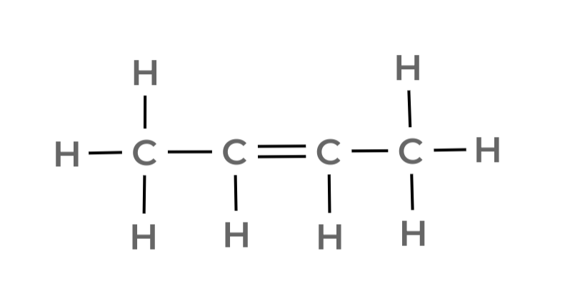
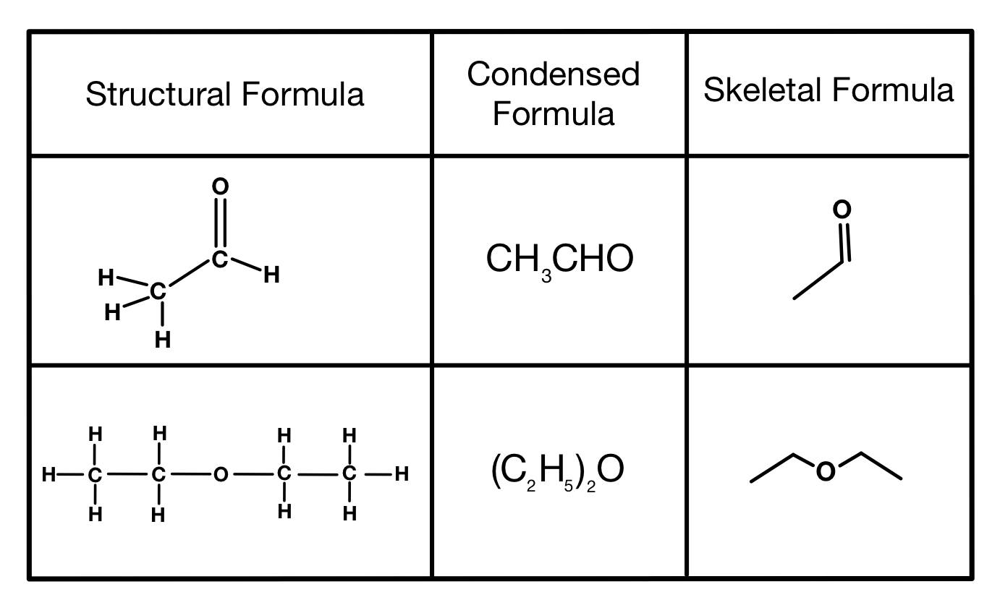

# Cadeias carbônicas

# O que é uma cadeia carbônica?

---

Como visto nos postulados de Kekulé, o **átomo de Carbono se liga com outros** formando **cadeias carbônicas**, aumentando a possibilidade de compostos orgânicos a níveis muito grandes. 

Entender as cadeias carbônicas, como representá-las e como estudá-las a partir das representações é essecial para a química orgânica, já que nos permitirá estudar reações entre compostos orgânicos e fenômenos como a isomeria.

## Classificação de um carbono numa cadeia

---

Dependendo **das ligações** de um dado átomo de carbono **numa cadeia**, é possível classificá-lo em alguns grupos. 

| **Carbono** | **# de carbonos a que está ligado** |
| --- | --- |
| Primário | 0 ou 1 |
| Secundário | 2 |
| Terciário | 3 |
| Quaternário | 4 |

# Representações de uma cadeia

---

Podemos representar uma cadeia carbônica de algumas maneiras, com a mais famosa sendo a **estrutura de Kekulé** (ou **fórmula estrutural**), uma adaptação da **fórmula de Lewis**: representamos as ligações dos átomos com traços, com cada tipo de traço indicando se uma dada ligação é **simples, dupla** ou **tripla**. 

Para montarmos a representação estrutural de uma cadeia a partir de sua fórmula molecular, lemos ela da esquerda para a direita e vamos conectando os átomos a medida que vamos percorrendo a fórmula molecular. 

Por exemplo, a cadeia $\text{CH}_3\text{[CH]}_2\text{CH3}$ pode ser representada da forma: 

*Se omitirmos os carbonos, ainda ganhamos mais uma forma, a **forma esqueletal!***

Vamos utilizar outra imagem para demonstrar a outra forma, derivada da **estrutura de Kekulé**, a chamada **estrutura esqueletal**. Para representar uma molécula nessa estrutura, abrevie a fórmula estrutural padrão **implicitando os carbonos e os hidrogênios**. 

*Essa imagem demonstra muito bem a utilidade da fórmula esqueletal: olha a diferença de espaço no segundo caso!*

Percebeu? Enquanto cada **dobra** das linhas representa um carbono, as pontas são completadas com hidrogênios. Todos os outros elementos são explicitados. 

Isso abrevia uma quantidade absurda de espaço, já que os compostos orgânicos possuem muitos, muitos carbonos (e também hidrogênios)!

Ainda temos dois outros símbolos para representação das moléculas, além dos traços, utilizados mais no contexto da **estereoquímica** (o estudo das moléculas químicas no espaço tridimensional), esses daqui! 

*Molécula-exemplo retirada da Pearson!*

Percebe a ligação **preenchida** e a **pontilhada**? A primeira significa que aquele átomo está **para frente do plano**, ou seja, na direção do observador (ao levar em conta o espaço tridimensional), enquanto a segunda significa o contrário: a molécula está atrás do plano da molécula, distante do observador. 

<aside>

Quer visualizar essas coisas com mais detalhes? A **internet é [muito útil](https://molview.org)!**

</aside>

# Tipos de ligação

---

Desta seção em diante, iremos analisar algumas propriedades e categorias que cadeias carbônicas possuem ou podem fazer parte, começando com uma análise um poucos mais aprofundada dos **tipos de ligação**. 

As ligações químicas numa cadeia carbônica (e em qualquer composto químico) podem ser, como dito anteriormente, **simples**, **duplas** ou **triplas**.

As ligações **simples**, representadas com apenas um único traço, são formadas por apenas uma ligação do tipo $\sigma$ (sigma), sendo mais longas que as demais (os átomos são mais afastados entre si do que as outras ligações) e mais fracas. 

As **duplas** são um pouco mais próximas e fortes, sendo formadas por uma ligação $\sigma$ e outra do tipo $\pi$ e representadas por **dois traços**, enquanto as **triplas** são representadas por **três traços** e formadas por uma ligação do tipo $\sigma$ e duas do tipo $\pi$ ($\pi^+$ e $\pi^-$), sendo as mais próximas dos três tipos e as mais fortes.

*Um exemplo de molécula orgânica: **cafeína!***

## NOX

---

O **número de oxidação**, conhecido pela sigla **NOX**, é um número que cada átomo num composto químico recebe, podendo ser positivo ou negativo. 

Essa medida permite responder a seguinte questão: se essa determinada ligação entre esses dois átomos em particular fosse quebrada, **para onde iriam os elétrons**? Nesse contexto, é necessário relembrar o conceito de **eletronegatividade**: alguns elementos atraem seus elementos mais fortemente que outros. 

Normalmente, seguimos a sequência $\underleftarrow{\text{FONClBrISCPH}}$ (note a seta!): o flúor $(\text F)$ possui a **maior eletronegatividade**, ganhando elétrons em relação a qualquer átomo, enquanto o hidrogênio $(\text H)$ **perde seu elétron para qualquer outro**, possuindo a **menor eletronegatividade**. 

Um NOX negativo significa que, se dada ligação fosse quebrada, **o elemento ganharia os elétrons**, se tornando um **ânion**. De forma análoga, um NOX positivo significa que o elemento **perderia** esse dado número de elétrons, tornando-se um **cátion**.

<aside>

*Acima temos o cálculo de NOX de uma molécula de **cafeína**, feito à mão! Essa versão é temporária, depois irei incluir uma versão digital.*

</aside>

# Classificação das cadeias carbônicas

---

Podemos classificar as **cadeias carbônicas** em várias categorias para facilitar nossos estudos. 

A quantidade de categorias é justificada pela quantidade absurda de cadeias possíveis que podemos formar, devido à flexibilidade das ligações do Carbono (lembre dos **postulados de Kekulé**)!

Uma primeira divisão que pode ser feita é a divisão entre compostos **alifáticos** ou **aromáticos**: os primeiros não possuem o **benzeno** em sua composição, enquanto os **aromáticos** o possuem. 

<aside>

O **benzeno**, ou **anel de benzeno**, **anel aromático** ou ainda **anel benzênico**, é uma organização peculiar de átomos de carbono, facilmente reconhecível em sua **fórmula esqueletal** por ser representado por um hexágono com ligações duplas e simples alternadas. 

*Um anel de **benzeno**!*

</aside>

## Compostos alifáticos

---

### Cadeias normais e ramificadas

Os **compostos alifáticos** possuem cadeias que podem ser classificadas em **normais** ou em **ramificadas**: as cadeias **normais** possuem uma úniica “fila” de átomos de Carbono, enquanto as cadeias **ramificadas** possuem, segundo o seu nome, **ramificações**, formando “galhos” como em uma árvore. 

Além disso, os compostos alifáticos podem ser formar **ciclos**, circuitos fechados de átomos de carbono - como o anel de benzeno mostrado acima! 

### Cadeias saturadas e não-saturadas

Essas cadeias também podem ser classificadas como **saturadas** ou **não-saturadas**: as cadeias **saturadas** possuem **todas as ligações carbônicas** do tipo **simples**, enquanto as cadeias não**-saturadas** são o **caso contrário**. 

### Cadeias homogêneas e heterogêneas

Uma outra classificação dentro dos compostos alifáticos que podemos fazer é separação das cadeias entre **homogêneas** e **heterogêneas**. As cadeias **homogêneas** não possuem interrupções nas “filas” de carbono, **formando uma só corrente**, enquanto as cadeias **heterogêneas** são o caso oposto: existe pelo menos um **átomo que “quebra” a corrente** carbônica.

Esse(s) átomo(s) é chamado **heteroátomo(s)**. 

## Compostos aromáticos

---

Todos os **compostos aromáticos**, possuem pelo menos um **anel de benzeno**. 

Os compostos **mononucleares** possuem apenas um **anel aromático**, enquanto os compostos **polinucleares** possuem mais de um. Os polinucleares ainda podem ser denominados **condensados** se os aneis benzênicos se “conectam” como uma cadeia de hexágonos, como na imagem abaixo. 

*Três aneis aromáticos colados! Um composto **polinuclear condensado**!*

# Regra de Hückel

---

A **regra de Hückel** nos fornece uma maneira simples de identificar se um composto é **aromático** ou não, mesmo em **casos mais gerais** (sim, há mais definições de “composto aromático” do que apenas possuir **benzeno**)! 

Essa regra estabelece que, se um dado composto satisfazer a equação $4n+2= \#  \text{ de ligações } \pi$, com $n \in \N$, então o composto analisado é um **composto aromático**. 

Por exemplo, um **anel de benzeno** possui 3 duplas ligações, ou seja possui 6 “**elétrons** $\pi$” (”elétrons”, nesse contexto, inclui todos os elétrons das ligações), ora, podemos solucionar a equação com $n=1$, logo, pela **regra de Hückel**, o benzeno é um composto aromático. 

## Uma definição mais ampla de aromaticidade

---

Por meio da regra de Hückel, podemos definir se um composto é **aromático** de forma mais ampla, se ele obedecer algumas condições: 

<aside>

1. Ser **cíclico** e **planar** (carbonos sp² ou sp!);
2. Conter elétrons $\pi$ ou **não-ligantes** no mesmo plano do anel; 
    1. Conter elétrons não-ligantes significa conter heteroátomos no que seria um perfeito anel benzênico.
3. Obedecer à regra de Hückel. 
</aside>