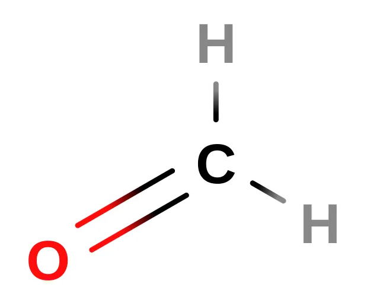
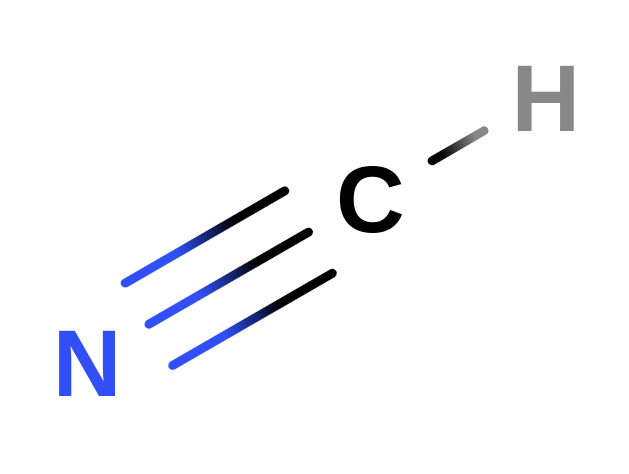
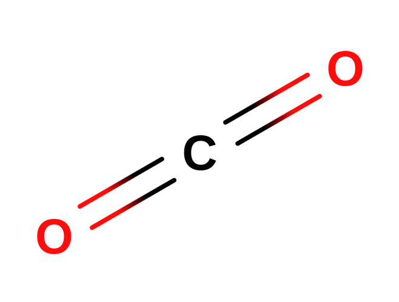

# Introdução à Química Orgânica

# Uma Breve Origem da Química Orgânica

---

No século XVIII, em 1777, Bergman, químico sueco, dividiu a crescente ciência da Química em duas áreas, a química inorgânica, química dos “minerais”, e a química orgânica, a “química dos seres vivos”. 

Nesse mesmo período, havia a Teoria da Força Vital, notavelmente defendida pelo químico sueco Berzelius em 1807, que dizia que somente os seres vivos podiam produzir, sintetizar, produtos orgânicos, produtos esses que Lavoisier verificou a presença de carbono em todos eles. 

Porém, em 1828, essa teoria, muito influente, foi derrubada pelo químico alemão Friedrich Wöhler: ele conseguiu sintetizar **ureia** (presente na urina) a partir de compostos inorgânicos, o que a Teoria da Força Vital via como impossível. 

Trinta anos depois, Friedrich August Kekulé, químico alemão, em meio a toda enfervescência científica do período, propôs à Academia uma nova maneira de definir a química orgânica, maneira essa que acabou sendo utilizada até hoje — a Química orgânica é a seção da química preocupada de forma especial com o Carbono e suas interações.

# Postulados de Kekulé

---

Além disso, Kekulé propôs alguns postulados, bases, para todo o estudo da química orgânica, referentes ao seu elemento central, o Carbono.

1. **O carbono é tetravalente**: sempre formando quatro ligações; 
2. **As quatro ligações do carbono são iguais:** não importa a maneira que denotamos uma dada molécula de carbono, ela é simétrica, são sempre as mesmas moléculas; 
3. **Os átomos de carbono podem ligar-se entre si formando cadeias:** isso permite uma quantidade absurda de combinações e compostos possíveis que podem ser feitos com o carbono; 

# Hibridação

---

O motivo do carbono conseguir sempre formar quatro ligações é o fenômeno da **hibridação**. 

A hibridação (ou hibridização) de orbitais acontece quando elétrons de orbitais completos saltam para outro orbital em outro subnível ao receberem energia, permitindo mais ligações e efetivamente “combinando” os subníveis numa única estrutura: **orbitais híbridos** foram formados. 

*No começo, o carbono só poderia formar duas ligações…*

*…mas com o salto e a combinação dos orbitais, agora ele consegue formar quatro!*

Existem vários **tipos** de hibridação, com cada uma delas representando quais orbitais foram hibridizados. Cada uma delas também possui um efeito diferente na geometria da molécula, por conta da **repulsão dos elétrons livres**. 

| **Tipo** | **Orbitais hibridizados** | **Geometria** | **Exemplo** |
| --- | --- | --- | --- |
| sp | 1s + 1p | Linear (180º)  | BeCl2, acetileno |
| sp² | 1s + 2p | Trigonal plana (120º) | BF3, etileno |
| sp³ | 1s + 3p | Tetraédrica (109.5°)  | CH4 |
| sp³d | 1s + 3p + 1d | Trigonal bipiramidal | PCl5 |
| sp³d² | 1s + 3d + 2d | Octaédrica | SF6 |

<aside>
Percebeu que nem todos os compostos exemplo da tabela são orgânicos? A **hibridação não é exclusiva do carbono!** Outros elementos conseguem passar pelo mesmo processo.
</aside>

Entretanto, como o carbono é **tetravalente sempre**, podemos restringir a tabela para apenas **três casos**:

| **Número de ligações** | **Tipo da hibridação** | **Geometria** |
| --- | --- | --- |
| 4 | sp³ | Tetraédrica (109.5°) |
| 3 | sp² | Trigonal plana (120°) |
| 2 | sp | Linear (180°) |

Um exemplo da primeira linha é a molécula de **metano** $(\text{CH}_4)$, o hidrocarboneto mais simples e comumente encontrado em depósitos de petróleo.

O carbono central da ligação possui quatro ligações: todas são simples em razão de sua **tetravalência**. 

Um exemplo para a segunda linha é o **formaldeído $(\text{CH}_2\text{O})$** ou **metanal**, conhecido mais comumente em sua forma diluída, o **formol**, utilizado para conservação de cadáveres, por exemplo.

O primeiro exemplo para a terceira linha pode ser dado pelo **cianeto de hidrogênio** $(\text{HCN})$, um composto extremamente volátil, inflamável e tóxico. Seu uso mais famoso foi durante a Segunda Guerra Mundial pela Alemanha Nazista nos campos de extermínio, onde era conhecido pelo seu nome comercial: **Zyklon B**. 

Por fim, o segundo exemplo para a terceira linha é o **dióxido de carbono** $(\text{CO}_2)$, gás produzido pela humanidade em grande volume desde o início da Revolução Industrial. É um dos grandes responsáveis pela intensificação do **efeito estufa**.