# Introdução às funções e séries orgânicas

# O que é uma função?

---

Antes de começarmos a descrever essa breve introdução sobre as **funções orgânicas**, vamos primeiro relembrar o que é uma **função**, na química. 

Uma função é **um grupo de compostos** que possui **características** químicas **semelhantes**, como por exemplo, se comportar de maneiras parecidas numa reação. 

As funções podem ser **inorgânicas** (ácidos e bases) e **orgânicas**, que são as que iremos enumerar e discutir um pouco nesse documento.

# Hidrocarbonetos

---

Os **hidrocarbonetos** são conhecidos por esse nome pela sua característica determinante: em sua composição, esses compostos possuem apenas **carbono** e **oxigênio**. Podemos já citar aqui dois hidrocarbonetos bem conhecidos: o **metano** $(\text{CH}_4)$ e o **benzeno $(\text{C}_6\text{H}_6)$**. 

# Funções oxigenadas

---

As **funções oxigenadas** são denominadas assim pois possuem oxigênio em sua composição. 

Esse grupo possui várias subdividisões, de acordo com a presença ou ausência nos compostos de três funções oxigenadas básicas: as **hidroxilas**, as **carboxilas** e as **carbonilas**. 

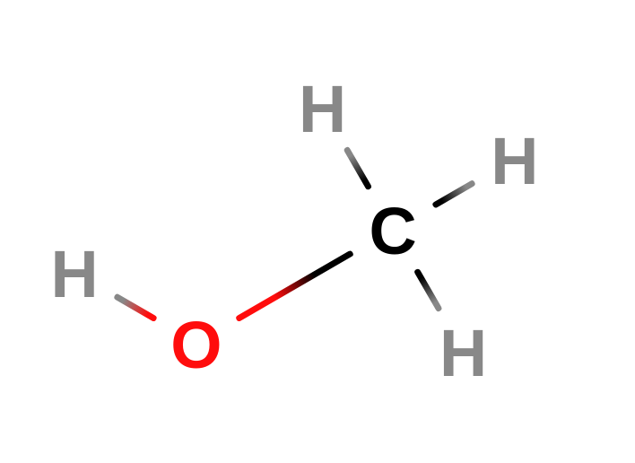

As **hidroxilas** são funções oxigenadas compostas por um átomo de oxigênio ligado **por ligações simples** a um átomo de hidrogênio e a um de carbono. 

Um exemplo de composto orgânico com uma hidroxila é o **metanol** $(\text{CH}_3\text{OH})$, visto ao lado, perceba a hidroxila no canto esquerdo! Esse **álcool** é um dos exemplos mais simples contendo uma hidroxila. 

As **carbonilas** são funções oxigenadas compostas por um átomo de carbono ligado a um oxigênio por uma **ligação dupla** e a outros dois átomos por ligação simples. 

Um exemplo de molécula com essa função é o **formol**, o $\text{CH}_2\text O$, muito utilizado para a preservação de cadáveres, por exemplo.

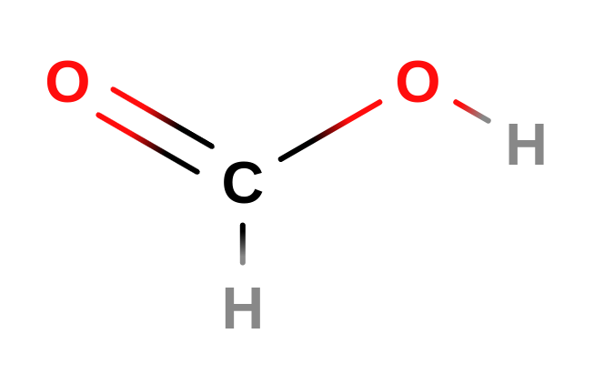

Por fim, as **carboxilas** são funções que podem ser entendidas como **carbonilas** onde **uma das duas ligações simples** do **carbono** é uma **hidroxila**. 

Um exemplo de molécula com uma carboxila é o **ácido metanoico** $(\text{CO}_2\text H_2)$! 

Esse ácido é o mais simples dos ácidos orgânicos.

## Álcoois, enóis e fenóis

---

Os **álcoois** são funções orgânicas que contém **hidroxilas** ligadas a um **carbono saturado**, ou seja, um carbono que **só possui ligações simples**. 

Eles ainda podem ser subdivididos em **primários, secundários ou terciários**, de acordo com a classificação do carbono da hidroxila. 

Os **enóis**, por sua vez, são funções orgânicas que possuem **hidroxilas** ligadas a um carbono que possui uma **ligação dupla**, enquanto os **fenóis** são funções cujas hidroxilas estão ligadas a um **anel aromático**. 

***Metanol**, um álcool bem simples.* 

*O **etenol**, o **enol** mais simples de todos.*

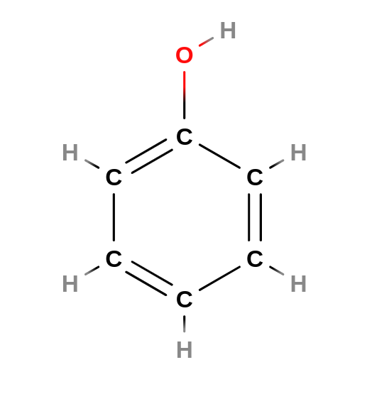

*O **fenol**.*

## Aldeídos e cetonas

---

Os **aldeídos** são funções orgânicas que possuem carbonilas **“nas pontas”** dos compostos, ou seja, que **não** possuem as **duas ligações simples** sendo átomos de **carbono**. O **caso contrário**, com o **carbono** da carbonila possuindo **ligações simples** com outros **dois carbonos**, é denominado **cetona**.

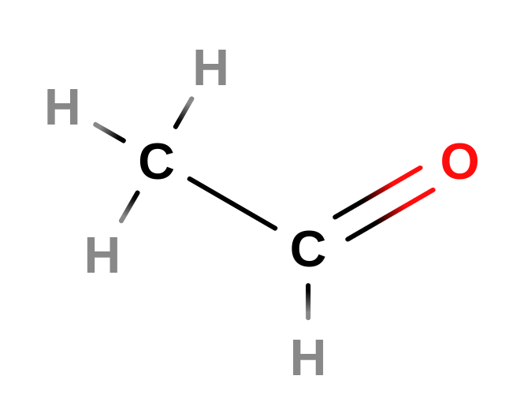

Um exemplo de **aldeído**, note a carboxila na “ponta da cadeia’’: somente uma das ligações simples é um carbono! 

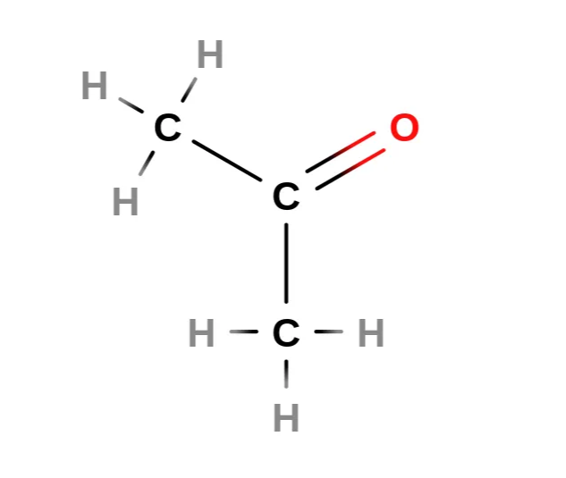

Uma molécula de **acetona**, que, surpreendemente, é um **cetona!** Perceba que ambas as ligações simples da carbolina são carbonos. 

## Éteres, ésteres e anidridos

---

Os **éteres** são funções orgânicas que possuem um **oxigênio** entre **dois carbonos**, enquanto os **ésteres** são **carbonilas**, com uma das ligações simples do carbono sendo um átomo de oxigênio, que por sua vez está ligado a um outro átomo de carbono. 

O **dimetiléter** ou **metoxímetano** é o éter mais simples de todos.

O **metanoato de metila**, éster formado pela reação do **ácido metanoico** com o **metanol**.

Por fim, um **anidrido** é formado ao ligarmos o último carbono a um outro átomo de oxigênio por meio de uma **ligação dupla**. 

# Funções nitrogenadas

---

Enquanto as funções **oxigenadas** possuem oxigênio em sua composição, as funções **nitrogenadas** possuem nitrogênio, são elas as **aminas**, **amidas, nitrocompostos e nitrilas**. 

## Aminas

---

As **aminas** são **funções** **parecidas com a amônia**: o nitrogênio central possui um par de elétrons livres e três ligações simples com outros átomos, sejam eles de **carbono** ou **nitrogênio**. 

Dependendo da quantidade de carbonos ligados ao nitrogênio central, podemos classificar as aminas em **primárias**, **secundárias** e **terciárias**. 

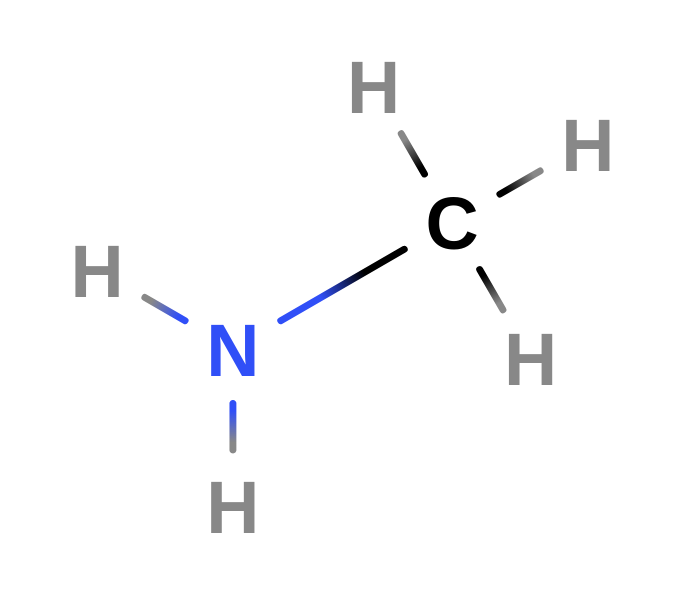

A molécula ao lado é a **metilamina** $(\text C \text H_5 \text N)$, sendo ela um exemplo de composto que possui uma uma **amina primária**: perceba que temos um nitrogênio ligado a outros dois hidrogênios e a um átomo de carbono por meio de **ligações simples**, o que caracteriza uma amina. 

Como o nitrogênio está ligado a apenas um átomo de carbono, a metilamina possui uma amina **primária**. 

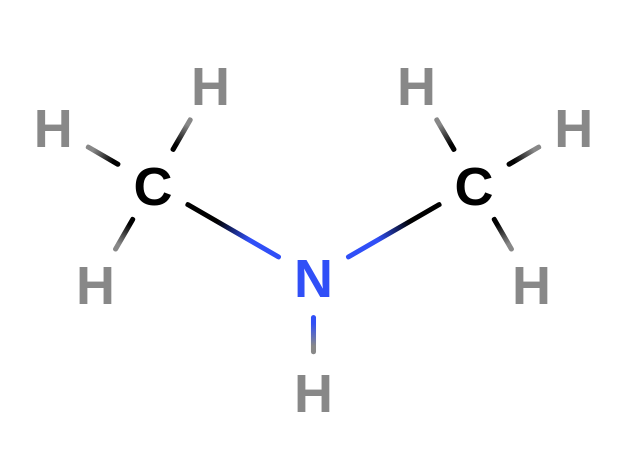

Essa é a **dimetilamina $(\text C_2 \text H_7 \text N)$**, um composto que possui uma **amina secundária**: o nitrogênio central está ligado a **dois** átomos de carbono e um de hidrogênio por ligações simples! 

Não esqueça o par de elétrons não-ligantes no Nitrogênio! 

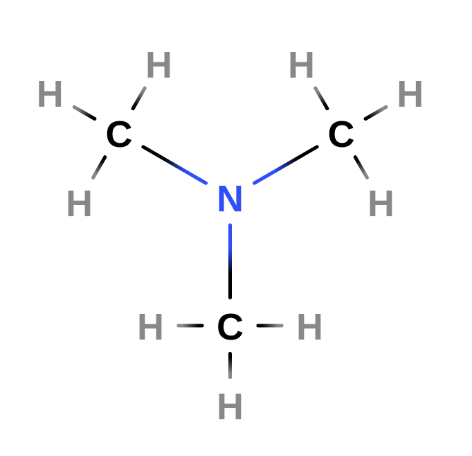

Para completar o padrão, a molécula ao lado é a **trimetilamina $(\text C_3 \text H_9 \text N)$,** um composto **extremamente tóxico** porém utilizado amplamente na fabricação de tintas, fertilizantes e herbicidas. 

Interessantemente, também é possível detectar a podridão de um peixe se ele estiver secretando esse composto. 

Perceba que o nitrogênio central está ligado a outros três átomos de carbono: uma amina **terciária!**

## Amidas

---

As **amidas** são funções orgânicas nitrogenadas cujo átomo de nitrogênio está ligado ao átomo de carbono de uma **carbonila** por uma **ligação simples**. 

Um exemplo de amida é o composto ao lado, uma **formamida** $(\text {CH}_3 \text{NO})$, perceba o **grupo amina** ao lado!

## Nitrocompostos

---

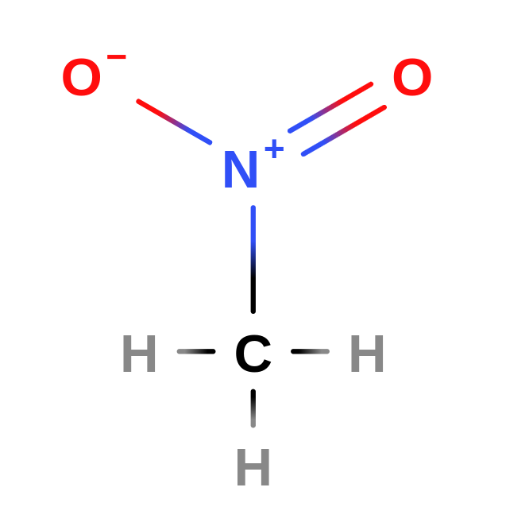

Também conhecidos pela denominação **nitroderivados**, os nitrocompostos são funções orgânicas que possuem um **grupo** **nitro** $(-\text{NO}_2)$. 

Os nitrocompostos são **comumente explosivos**.

Ao lado, temos uma molécula de **nitrometano** $(\text {CH}_3 \text {NO}_2)$, o nitrocomposto mais simples de todos, utilizado de várias formas, variando de aditivos para combustíveis até como solvente para reações químicas.

## Nitrilas

---

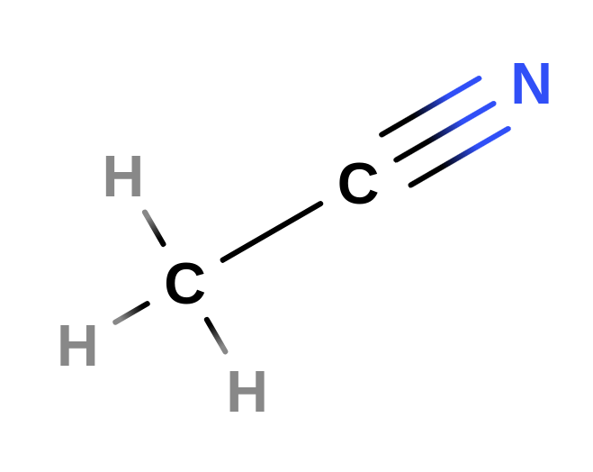

As **nitrilas** são funções orgânicas caracterizadas por possuírem um **grupo $-\text {CN}$**, com o carbono ligado a outra **função orgânica**: caso isso não aconteça, estamos observendo um **cianeto**, não uma nitrila! 

A molécula ao lado, a **acetonitrila** $(\text C_2 \text H _3 \text N)$, é a **nitrila** mais simples de todas, utilizada em fabricações industriais e na fabricação de baterias, por exemplo. 

# Compostos halogenados

---

Por fim, temos os **compostos halogenados**, ou seja, compostos orgânicos que contam com a presença de **halogênios**, normalmente flúor ou cloro.

## Haletos de alquila

---

Também conhecidos pela denominação **haloalcanos**, os **haletos de alquila** são compostos orgânicos que possuem uma ligação entre um **carbono alifático** e um halogênio. 

Ao lado, temos o **bromometano** $(\text {CH}_3 \text {Br})$, um exemplo de haloalcano formado pela substituição de um dos hidrogênios do metano por um átomo de bromo.

## Haletos de acila

---

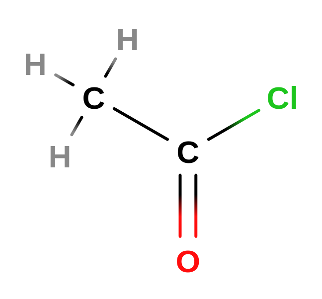

De forma semelhante, os **haletos de acila** são compostos orgânicos formados geralmente pela substituição de uma **hidroxila** num **ácido carboxilíco** por um halogênio.

Um exemplo dessa categoria é o **cloreto de acetila $(\text C \text H_3 \text {COCl})$**, visto ao lado. 

É um dos haletos de acila mais simples! 

# Série orgânica

---

Como forma de ajudar na comparação entre moléculas orgânicas, podemos utilizar o conceito de **séries orgânicas**, nada mais que um outro nome para **conjuntos de compostos orgânicos**, com esses conjuntos sendo divididos em algumas categorias, com base na comparação entre as cadeias carbônicas desse conjunto, da minha série. 

As **séries homólogas** são conjuntos onde a diferença entre os compostos é um elo $-\text {CH}_2$. Um exemplo de série homóloga seria o conjunto $\{\text{C}\text{H}_4,\text{C}_2\text{H}_6, \text{C}_3\text{H}_8, ...\}$.

As **séries isólogas** são conjuntos onde a diferença entre dois compostos consecutivos é um $\text H_2$, como por exemplo, a série $\{\text C_2 \text H_2, \text C_2 \text H_4, \text C_2 \text H_6...\}$

Por fim, as **séries heterólogas** são conjuntos de compostos orgânicos de funções distintas, porém com a mesma quantidade de átomos de carbono, por exemplo, o conjunto…

$$
\{\text {CH}_3 \text{CH}_2 \text{CH}_2\text {OH}, \text {CH}_3 \text{CH}_2 \text{CH}_2\text {O}, \text {CH}_3 \text{COCH}_3\}
$$

# Regras de nomenclatura

---

Pela imensa quantidade de possíveis compostos orgânicos, observou-se a necessidade de criar uma padronização na questão da nomenclatura. Essa padronização veio em 1892 e continua até os dias de hoje pelas regras da IUPAC (*International Union of Pure and Applied Chemistry -* União Internacional da Química Pura e Aplicada). 

As regras da IUPAC foram construídas a partir de dois princípios básicos: 

1. Cada composto orgânico deve ter um nome próprio, diferente dos outros; 
2. A partir do nome de um dado composto, deve ser possível esquematizar sua fórmula estrutural e vice-versa. 

Oficialmente, a nomenclatura IUPAC é estruturada da seguinte maneira: 

$$
\text {Prefixo + Intermediário + Sufixo}
$$

com o **prefixo** indicando o **número** de átomos de carbono na cadeia principal, o **intermediário** indicando o **tipo de ligação** entre os carbonos e o **sufixo** indicando a **função** do composto orgânico. 

Todas as outras regras de nomenclatura são construídas partindo dessa estrutura básica. 

## Estrutura básica da nomenclatura IUPAC

---

### Prefixos

---

| **# de Carbonos** | **Prefixo** |
| --- | --- |
| 1 | Met- |
| 2 | Et- |
| 3 | Prop- |
| 4 | But- |
| 5 | Pent- |
| 6 | Hex- |
| 7 | Hept- |
| 8 | Oct- |
| 9 | Non- |
| 10 | Dec- |
| 11 | Undec- |

Se o composto orgânico for cíclico, ele ainda ganha um prefixo adicional (”**ciclo-”**), que precede todos os outros termos, por exemplo: **ciclopropano**. 

### Intermediários

---

| **Saturação** | **Intermediário** |
| --- | --- |
| Saturadas (todas ligações simples) | -an- |
| 1 dupla | -en- |
| 2 duplas | -dien- |
| 3 duplas  | -trien- |
| 1 tripla  | -in- |
| 2 triplas | -diin- |
| 3 triplas  | -triin- |
| 1 dupla + 1 tripla  | -enin- |

### Sufixos

---

| **Função** | **Sufixo** |
| --- | --- |
| Hidrocarboneto | -o |
| Álcool | -ol |
| Aldeído | -al |
| Cetona | -ona |
| Ácido Carboxilíco | -óico |

## Regras adicionais

---

As regras dessa seção são complementares da estrutura básica, servindo para categorizar ainda mais os compostos orgânicos de forma que cumpram com os objetivos básicos da IUPAC. 

*Molécula de **but-2-en-1-ol**: a numeração começa pelo carbono mais próximo do grupo funcional, a hidroxila: no carbono “1” temos o OH, enquanto no carbono 2 temos a ligação dupla.*

Primeiramente, **se a cadeia carbônica permitir diferentes localizações** para **grupos funcionais** ou **insaturações**, é **obrigatório numerar os carbonos da cadeia principal** para indicar a **posição exata** dessas características, com a **numeração começando pela extremidade mais próxima do grupo funcional** ou, no caso de um hidrocarboneto, da insaturação (se houver).

Uma outra indicação é a seguinte: **se houver mais de uma possibilidade de numeração**, é necessário **escolher** aquela que faça com que a **soma dos números que indicam as ramificações**, saturações e os grupos funcionais seja a **menor possível**.

*Molécula de **3-metilpentano:** a molécula possui um metil, presente no carbono **3**, sinalizado na nomenclatura.* 

Todas as outras regras mais específicas, com o por exemplo a ausência de numeração num composto cíclico, são consequências diretas das regras acima.

### Ramificações

---

As ramificações da **cadeia principal** - a sequência de maior átomos de carbono - são indicadas na nomenclatura IUPAC por meio do número do carbono da cadeia principal. 

Elas são indicadas antes da cadeia principal na ordem da nomenclatura, porém com prioridade menor que os grupos funcionais, e maior que as insaturações. 

Para ajudar na nomenclatura das ramificações, indicamos **radicais** que podem formar essas ramificações, na tabela abaixo.

<aside>
Radicais são compostos orgânicos que perderam um **hidrogênio**, se tornando instáveis. Normalmente, se ligam as cadeias carbônicas que possuem uma valência livre, formando ramificações. 
</aside>

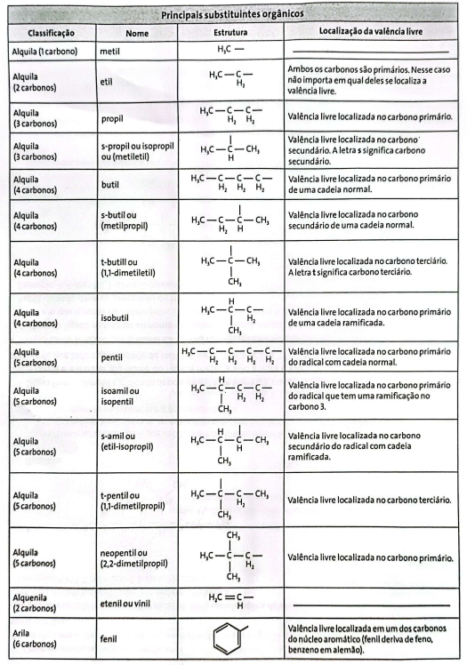

*Retirada de um livro, mas bem completa! (OBS.: Será substituída por uma tabela autoral em breve...)*

Por exemplo, o composto **3-metilpentano** é chamado assim por possuir um **metil** ligado no terceiro carbono da cadeia principal.

# Regras específicas

---

Em alguns casos, algumas regras específicas são utilizadas para algumas funções orgânicas. Elas serão descorridas abaixo. 

## Hidrocarbonetos aromáticos

---

Um exemplo da primeira regra ao lado, um nitrobenzeno! 
Perceba que o -NO2 é o mesmo composto dos nitrocompostos. 

No caso dos hidrocarbonetos aromáticos, para nomearmos um composto formado por **um anel de benzeno com um de seus hidrogênios substituídos por algum elemento ou cadeia** (benzenos *monossubstituídos*), nos utilizamos da forma 

$$
\text {Nome do substituinte + -benzeno}
$$

Segundamente, é interessante a definição dos grupos **fenil e benzil**. Os **fenis** são benzenos com um de seus hidrogênios removidos, fazendo parte de alguma outra molécula orgânica, enquanto os **benzis** são benzenos com um de seus hidrogênios removidos e conectado com um grupo **metileno** $(\text {CH}_2)$, que por sua vez é conectado com outra molécula orgânica. 

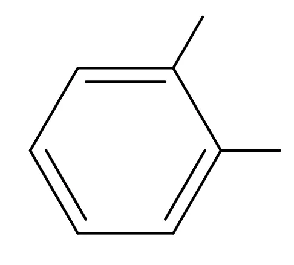

*Um exemplo de benzeno dissubstituído, o 1,2-dimetilbenzeno!*

Já quando estamos interessados em benzenos *disssubstituídos*, ou seja, com dois de seus hidrogênios substituídos por algum outro composto, temos alguns prefixos que são adicionados, sendo eles: 

1. **orto-**, quando os dois compostos estão um do lado do outro no anel 
2. **meta-**, quando estão separados por um carbono e 
3. **para-**, quando estão diametralmente opostos no anel 

Com três ou mais substituições, eles passam a ser nomeados como os compostos cíclicos.

*Exemplo de fenil, o fenol: um anel benzênico ligado a uma hidroxila.*

*Um exemplo de benzil, a benzilamina! Esse composto é formado por um anel benzênico ligado a um metileno (-CH2) e a uma amina primária.* 

## Compostos nitrogenados

---

Essa seção será dedicada às regras específicas regendo o conjunto dos compostos nitrogenados, ou seja, as aminas, amidas, nitrocompostos e sais de amônio.

### Aminas

---

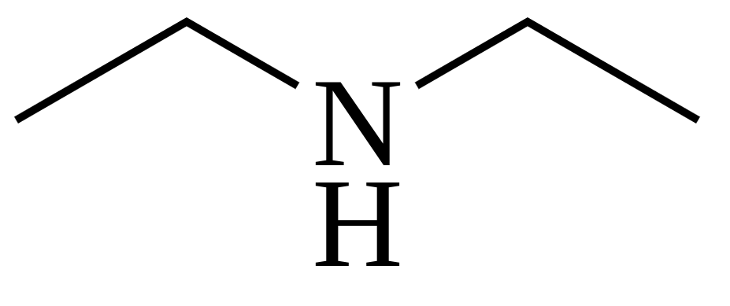

***Dimetilamina** é o nome mais comum desse composto, mas seguindo as orientações da IUPAC, chegamos na nomenclatura ***N*-Etiletanoamina**.* 

No caso das **aminas primárias**, formamos seus nomes pelo mesmo padrão básico de nomenclatura, por meio das outras partes do composto, finalizando com o sufixo **“-amina”**. 

No caso das aminas **secundárias** e **terciárias**, as cadeias menores ligadas ao nitrogênio são consideradas ramificações, indicadas pela letra $\text N$. 

### Amidas

---

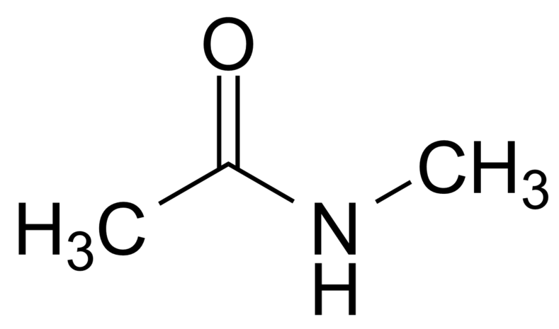

*Este composto é a **N-Metilacetamida**, formado pela substituição de um hidrogênio da acetamida por um grupo metil. É potencialmente perigosa para o sistema reprodutivo humano.*

A nomenclatura das amidas primárias segue o mesmo padrão das aminas, só mudando o sufixo. 

No caso das amidas secundárias e terciárias, devemos colocar a letra $\text N$ para identificar os substituintes ligados ao nitrogênio. 

### Nitrocompostos

---

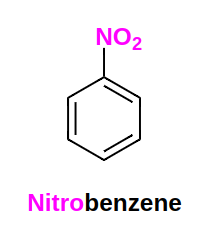

A nomenclatura dos nitrocompostos é dada pela adição do prefixo **“nitro-”** ao composto correspondente.

O composto acima é o **nitrobenzeno**, também chamado de nitrobenzol. Esse composto é utilizado em laboratório como solvente e em processos industriais como precursor da **anilina,** utilizada na confecção de esponjas de prato, por exemplo. 

### Nitrila

---

*De forma semelhante, as nitrilas são nomeadas pela adição do sufixo **“-nitrila”** ao alcano correspondente.*

Ao lado temos a **acetonitrila**, também conhecida pelo seu outro nome **cianeto de metila**. 

Esse composto é instável e inflamável. 

### Sal quaternário de amônio

---

*O composto acima é o CTAB, ou brometo de hexadeciltrimetilamônio. É um sólido em temperatura ambiente, utilizado na extração de DNA.*

Os sais quaternários de amônio podem ser entendidos na nomenclatura como uma variação das aminas. 

Dessa forma, para nomearmos esses sais, nos utilizamos das mesmas regras das aminas secundárias e terciárias, com a exceção de que o sufixo utlizado será **“-amônio”** além da adição do nome do ânion que acompanha o cátion de nitrogênio. 

## Compostos oxigenados

---

Essa seção será dedicada a algumas notas sobre a nomenclatura dos compostos nitrogenados, em especial aos **anidridos, ésteres, éteres** e **sais de ácidos carboxilícos.**

### Anidridos

---

A nomenclatura dos anidridos é feita pela adição do nome **anidrido**, com o nome, separado por hífen, dos dois ácidos originais da reação. Se os ácidos forem iguais, só é necessário a inclusão do nome uma única vez. Por exemplo, temos o **anidrido etanóico** - formado pela combinação de dois ácidos etanóicos - ou o **anidrido etanoico-butanoico**. 

### Ésteres

---

No caso da nomenclatura dos ésteres, temos que o nome é formado pela nomenclatura do ácido original, trocando o sufixo **“-óico”** por **“-ato”, seguido da preposição “de”** e pelo **nome do radical orgânico** que substituiu o hidrogênio da hidroxila original. 

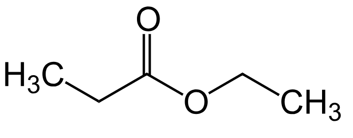

*Por exemplo, esse ácido é chamado de **propanoato de etila!***

### Éteres

---

A nomenclatura da IUPAC no caso dos **éteres** é formada pelo prefixo sendo o prefixo do **menor grupo orgânico**, seguido pelo radical **oxi** e pelo nome do hidrocarboneto correspondente ao maior grupo, por exemplo, o **etoxietano**: 

$$
\text {CH}_2-\text{CH}_2-\text O-\text {CH}_2 - \text {CH}_2
$$

### Sais de ácidos carboxilícos

---

A nomenclatura dos **sais** provenientes dos ácidos carboxilícos segue o padrão da substituição do sufixo **“-óico”** por **“-ato”, seguido pela preposição “de”** e o **nome do elemento** que faz parte do sal, por exemplo, o **3-metilbutanoato de potássio**. 

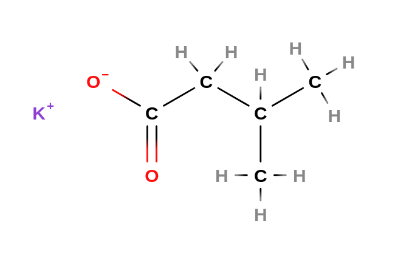

*Um sal! Perceba que esse composto está ligado por uma **ligação iônica**, característica dos sais.*