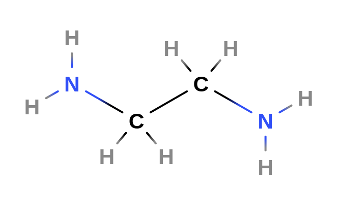
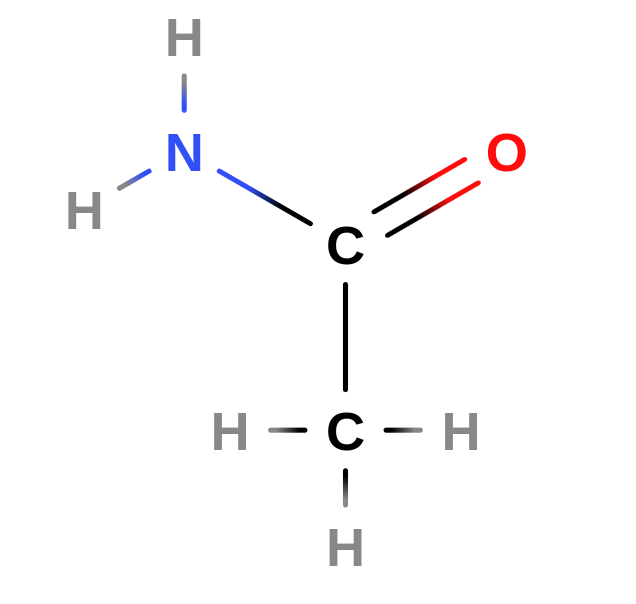
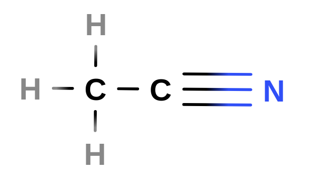

# Funções nitrogenadas

# Aminas

---

As **aminas** são compostos orgânicos nitrogenados derivados da amônia $(\text {NH}_3)$ pela subsittuição de um ou mais nitrogênios por radicais orgânicos. 

Esses compostos possuem caráter básico segundo a classificação de Lewis. 

As aminas primárias são chamadas assim pois apenas um de seus hidrogênios é substituído por um radical orgânico, com as secundárias possuindo duas substituições e as terciárias três. 

*Exemplo de amina, a **etilenodiamina** ou, na nomenclatura IUPAC, 1,2-diaminoetano. É um composto muito utilizado na indústria química como precursos de muitos outros compostos.* 

# Amidas

---

As **amidas** são derivadas dos ácidos carboxilícos, apresentando uma **carbonila** ligada a um nitrogênio. 

Podem ser classificadas em prinmárias, secundárias e terciárias, com uma amida cíclica chamada de lactoma. 

*Exemplo de amida, a **etanamida**. Esse composto é amplamente utilizado como solvente industrial.* 

# Nitrocomposto

---

São compostos orgânicos que possuem o grupo **nitro $(\text {NO}_2)$** ligado a alguma cadeia carbônica. 

*Acima nós temos um dos nitrocompostos mais famosos, o trinitrotolueno, ou em seu nome IUPAC **2-metil-1,3,5-trinitrobenzeno**. O TNT é um ingrediente importante*

# Nitrila

---

São substâncias que possuem o grupo funcional $\text {--CN}$. Originam-se da substituição do hidrogênio do ácido cianídrico por um radical orgânico. 

*Como exemplo de nitrila temos a **etanonitrila** ou **cianeto de metila**, a nitrila mais simples. Esse composto é utilizado como solvente em reações químicas e na purificação do butadieno. Possui capacidade explosiva.*

# Sal quaternário de amônio

---

Origina-se da substituição dos hidrogênios presentes no amônio $(\text{NH}_4⁺)$ por radicais orgânicos. 

Apresenta sempre um ânion ligado ao cátion. 

*Um exemplo de sal quaternário de amônio é a **betaína**, inclusive, um dos únicos compostos naturais que exemplificam essa classe. A betaína ocorre naturalmente nos metabolismos vegetal e animal.*