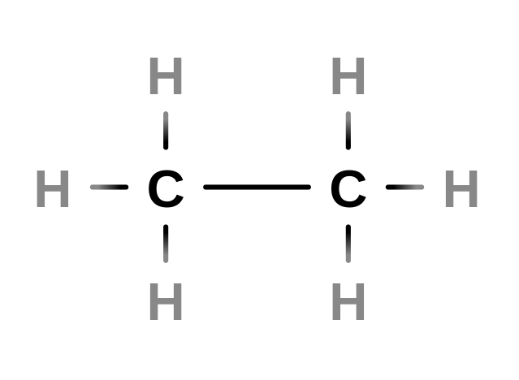
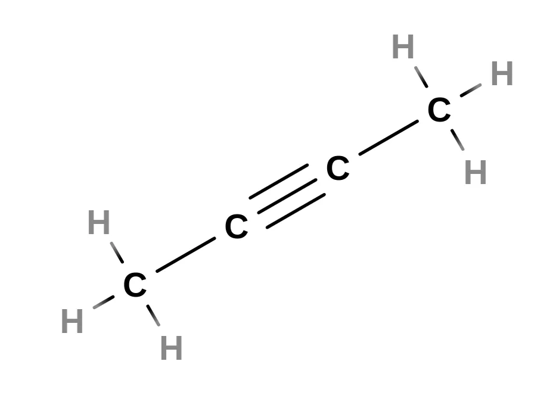

# Hidrocarbonetos

# Introdução

---

Como dito **anteriormente**, os **hidrocarbonetos** são compostos orgânicos formados apenas por átomos de carbono e hidrogênio. Assim como outros conjuntos, os hidrocarbonetos possuem subclassificações com o objetivo de facilitar o estudo científico.

# Alcanos

---

*Aqui temos o **etano (C2H6)**, o segundo alcano mais simples, depois do metano.*

Os **alcanos**, também chamados **parafinas**, são hidrocarbonetos de cadeia aberta e saturada, com todos os seus carbonos possuido **hibridação sp³** (quatro ligações, geometria tetraédrica).

Sua fórmula geral é sempre no formato  $\text {C}_n \text {H}_{2n+2}$. 

Os alcanos são notados por sua estabilidade, graças ao fato de só possuírem ligações simples (sigma) decorrentes de sua hibridação. 

# Alcenos

---

O **tetrametiletileno** (C6H12) é um alceno, sua reatividade faz com que ele seja um composto inflamável e perigoso para a saúde, utilizado na fabricação de herbicidas.

Os **alcenos**, conhecidos também pela denominação **etilenos**, pelo fato do etileno ser o alceno mais simples, são hidrocarbonetos que possuem uma única ligação dupla entre carbonos em sua composição. Suas moléculas também são insaturadas e de cadeia aberta, sendo mais reativas que os alcanos pela presença de uma ligação $\pi$. 

Pela sua dificuldade em serem encontrados naturalmente, geralmente são sintetizados em laboratório, com sua fórmula geral sendo $\text C_n \text H_{2n}$. 

# Alcadienos

---

*O **1,3-butadieno** é um alcadieno industrialmente importante para a produção de borracha sintética. O 1 e o 3 indicam as posições das ligações duplas.* 

Os **alcadienos** são hidrocarbonetos que possuem duas ligações duplas entre carbonos. 

No caso de sua nomenclatura, a numeração começa a partir da extremidade mais próxima das duas ligações duplas. 

Se acontecer o caso de equidistância, considera-se a ramificação. 

# Alcinos, alceninos, ciclanos, ciclenos e benzenos

---

O **2-butino** é um alcino utilizado na fabricação sintética da vitamina E. Sob condições normais de temperatura e pressão, é um líquido reativo e incolor, de odor pungente. 

O **1,3-butenino** é um alcenino, normalmente presente em estado gasoso durante condições normais. Era utilizado industrialmente, mas acabou sendo ausentado pelas crescentes preocupações de segurança: ele consegue se autodetonar (explodir sem a presença de ar) se deixado sob uma pressão muito intensa.

Os **alcinos**, por sua vez, são hidrocarbonetos insaturados com uma única ligação tripla. 

Por conta da alta instabilidade provocada pelas suas ligações $\pi$, os alcinos são compostos muito reativos. 

A fórmula geral dos alcinos é dada por $\text C_n \text H_{2n-2}$. 

Os **alceninos**, por sua vez, apresentam uma ligação dupla e uma tripla: na nomenclatura, a ligação dupla possui prioridade. 

Já os **ciclanos** são análogos cíclicos dos alcanos: hidrocarbonetos cíclicos com apenas ligações simples. Sua fórmula geral é dada por $\text C_n \text H_{2n}$. 

Sua nomenclatura é idêntica aos ciclanos, com a adição do prefixo **“ciclo-”**.

A mesma lógica segue para os ciclenos. 

Por fim, no caso dos compostos aromáticos, sua nomenclatura segue o mesmo padrão das outras, com a exceção da adição do sufixo **-benzeno**.