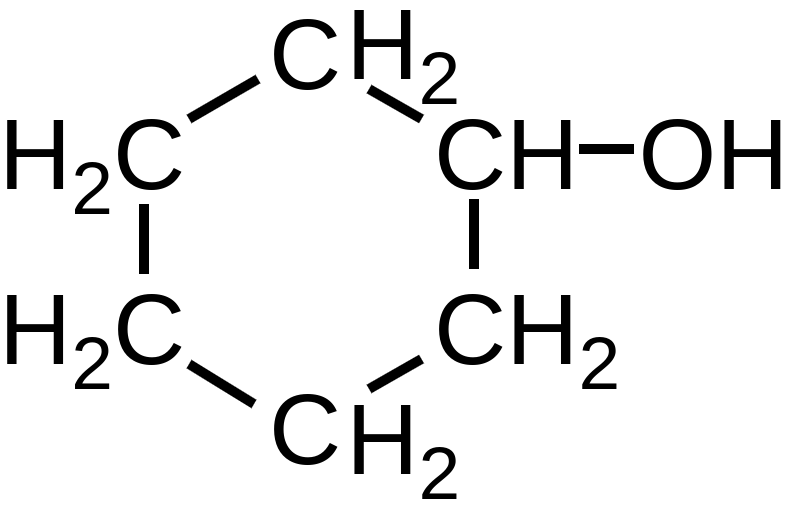
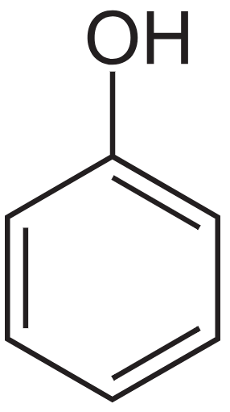
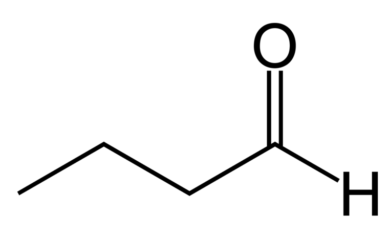

# Funções oxigenadas

# Álcool

---

Definimos **álcool** como sendo todo composto orgânico que possui uma hidroxila ligada diretamente a um carbono saturado em hibridação $\text{sp}^3$ (todas as ligações simples). 

Podemos classificá-los em **primários**, **secundários** ou **terciários**, a depender do tipo de carbono que a hidroxila está ligada: se ela estiver ligada a carbonos primários, o álcool será primário, e assim por diante. 

*Representação estrutural do **ciclohexanol**.*

O álcool ao lado é o **ciclohexanol**, classificado como um **álcool secundário**. 

Esse composto é importante industrialmente, sendo uma molécula precursora do nylon, sim, o *nylon*, polímero que é utilizado para formação de **tecido sintético**!

# Enóis

---

Os **enóis** são compostos que apresentam uma ou mais hidroxilas ligadas a átomos de carbonos **insaturados**. Esses compostos são instáveis, facilmente se convertendo em **aldeídos** ou **cetonas**.

Eles também podem ser entendidos como **alcenos** que possuem uma hidroxila ligada a um dos átomos de carbono insaturados. 

*O fenol! É composto por um grupo fenil (anel benzênico sem um hidrogênio) ligado a uma hidroxila.*

Ao lado está o **fenol** - um *spoiler* da próxima seção! 

O fenol é um enol, formado por uma hidroxila substituindo um hidrogênio do anel benzênico. 

Esse composto é crucial no meio industrial, sendo o precursor de diversos materiais como explosivos, fibras sintéticas, herbicidas, policarbonatos e muitas drogas farmacêuticas. 

É volátil, evaporando facilmente, devendo ser manuseado com cuidado pelo risco de causar queimaduras químicas. 

É corrosivo, solúvel em água e tóxico para seres vivos.

# Fenóis

---

Os **fenóis** são compostos que apresentam uma ou mais hidroxilas ligadas diretamente um carbono do **anel benzênico**. Uma característica importante dos fenóis é que eles possuem um caráter ácido, ionizando-se em meio aquoso, por exemplo… 

](images/oxygenated_functions/phenol_ion.png)

*Imagem retirada aqui: [https://derekcarrsavvy-chemist.blogspot.com/2018/09/aromatic-chemistry-4-phenol.html](https://derekcarrsavvy-chemist.blogspot.com/2018/09/aromatic-chemistry-4-phenol.html)*

Na reação acima, podemos ver a ionização do fenol, nome comum do **hidroxibenzeno**, além do fato de que sua reação é reversível. 

# Cetonas

---

Os cetonas são compostos que apresentam a função **carbonila** (um carbono ligado duplamente a um oxigênio) entre carbonos. 

*Formula estrutural do acetona. Perceba os dois metis! Por conta disso, ele também é conhecido como **dimetilcetona**. É conhecido na nomenclatura IUPAC como **propan-2-ona**. *

O acetona é o cetona mais simples, utilizado tanto como solvente industrial como produto de higiene para vidros de laboratório (e em uso cosmético)! 

# Aldeídos

---

Os **aldeídos** são compostos que têm uma **carbonila** na ponta da cadeia com uma das outras ligações sendo a um hidrogênio. 

*Uma cobrinha!*

*Como exemplo de aldeído podemos citar o **butiraldeído**, também conhecido pela denominação **butanal**. Esse composto é um líquido inflamável e de odor desagradável, sendo utilizado na produção de resinas e como solvente industrial.*

# Ácido carboxilíco

---

Os ácidos carboxilícos são chamados assim por possuírem uma **carboxila** (um carbono ligado duplamente a um hidrogênio e simplesmente a uma hidroxila) ligada a uma cadeia carbônica. 

O **ácido propanoico** é um ácido carboxilíco produzido por algumas bactérias no interior do organismo animal (inclusive humano), por parte do processo de digestão de alguns alimentos. 

Ele é bem corrosivo e também inflamável! 

A presença de oxigênio contribui para sua instabilidade. 

## Ácidos graxos

---

Os **ácidos graxos** são muito importantes na Biologia, sendo um subconjunto dos ácidos carboxilícos, mais especificamente, esses ácidos são ácidos carboxilícos de **cadeia alifática**, podendo ser saturada ou não. 

*Geralmente eles possuem uma cadeia looooooooooooooooooooonga!*

## Anidrido

---

**Anidridos de ácidos carboxilícos** são compostos orgânicos oxigenados originados de uma relação de **eliminação** ou **desidratação** entre dois ácidos carboxilícos. 

*Essa é a forma geral de um anidrido! Imagine que nas pontas das ligações simples, estão ligados dois radicais orgânicos!*

Podemos citar como exemplo o **anidrido metanoico-propanoico**. 

A nomenclatura é bem sugestiva, mas ela é falada sobre na página introdutória sobre as funções orgânicas!

*“Anidrido” tem suas raízes no grego, significando “sem água”, por conta das reações de desidratação que originam esses compostos.*

# Éster

---

Os **ésteres** são compostos orgânicos derivados dos ácidos carboxilícos, formados pela substituição do hidrogênio da hidroxila por algum grupo orgânico. 

Ou seja, os ésteres são ácidos carboxilícos com o $\text H$ da hidroxila trocado por algum grupo orgânico.

Os dois oxigênios tornam o composto bem reativo…

Ao lado temos o **propanoato de etila**, um éster inflamável e que está na lista de produtos perigosos para transporte do Governo Brasileiro (!). 

Esse composto possui cheiro que lembra abacaxi, sendo utilizado na produção de remédios anti-malária.

# Éter

---

Os **éteres** são compostos orgânicos formados por um átomo de oxigênio ligado a dos outros radicais orgânicos.

Por conta da presença do oxigênio no meio da cadeia carbônica, os éteres são bem reativos. 

*Esse carinha é extremamente inflamável!*

Como exemplo de éter, podemos citar o **etoxietano**, um dos éteres mais simples, utilizado inicialmente como anestésico, mas abandonado por causa do alto risco de explosão.