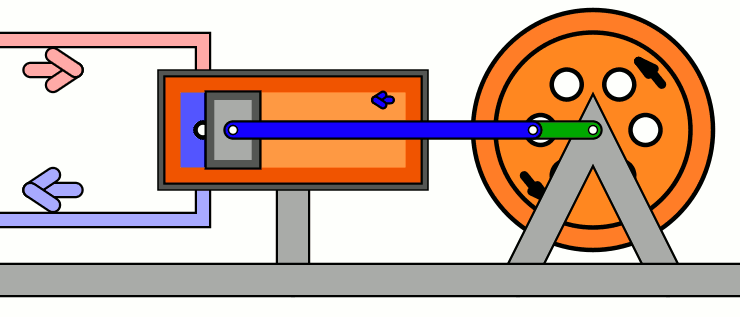

# Introdução à Termodinâmica

# Introdução

---

Termodinâmica é o estudo de como o **calor** consegue realizar trabalho (isto é, transferir energia) e por consequência ser utilizado para os mais variados propósitos, como mover máquinas. Ao longo do tempo, diferentes estudos e as famosas **leis da termodinâmica** foram desenvolvidas.

Esse exemplo foi uma das grandes razões pelo desenvolvimento acelerado da termodinâmica na ciência nos últimos séculos, começando pela Revolução Industrial, que foi impulsionada por máquinas à vapor. 

.*](../images/introduction_thermodynamics/introduction_thermodynamics_steam_engine_2.gif)

*Um motor à vapor, provavelmente o exemplo clássico da termodinâmica. A pressão exercida pelo vapor exerce uma força que move os pistões. GIF sob CC-BY, via [Wikimedia Commons](https://commons.wikimedia.org/wiki/File:Steam_engine_in_action.gif).*

Para darmos inicio ao estudo da termodinâmica, iremos primeiro discorrer sobre gases, o gás ideal e as transformações gasosas, o meio mais comum e prático de trabalho termodinâmico que temos à disposição. 

# Gases

---

Chamamos **gases** os corpos físicos formados por partículas em movimento, com grande quantidade de energia cinética que, ao contrário dos **vapores**, não conseguem ser condensados com facilidade a partir de mudanças em sua temperatura e pressão. 

No estudo dos gases, a **teoria cinética** dos gases nos fornece o conceito de **gás ideal**, um gás hipotético cujas partículas estão sempre em um movimento aleatório e constante. A velocidade dessas partículas está relacionada com a temperatura desse gás. 

Embora nenhum gás real possua essas características, o gás ideal se torna uma aproximação cada vez melhor da realidade a medida que aumentamos a temperatura e diminuímos a pressão sobre o gás analisado.

Geralmente em nossos estudos, utilizamos como aproximação o **gás ideal**, pela facilidade que isso nos oferece, embora em pesquisas mais sérias, essa aproximação se torna tão eficaz e novos métodos devem ser adotados.

*Se você pudesse ver um gás bem de perto, veria várias partículas “voando” livremente em colisões perfeitamente elásticas. Essa visão é explicada pela “Teoria Cinética dos Gases”. Domínio público, via Wikimedia Commons.* 

A formulação dessa **teoria cinética dos gases** iniciou-se nos princípios da termodinâmica, que surgiu da **mecânica estatística** e suas formulações a partir do modelo de gás mencionado anteriormente permitu grandes avanços na compreensão física de seus comportamentos. 

## A Lei dos Gases Ideais

---

A chamada **Lei dos Gases Ideais** foi enunciada no começo do século XIX pelo físico francês Émile Clapeyron, a partir da combinação das leis empíricas de Boyle, Charles, Avogadro e Gay-Lussac e, posteriormente, derivada por dois alemães, August Krönig e Rudolf Clausius, que utilizaram-se da mecânica estatística.

A relação, conhecida por ser uma **equação de estado**, — pois relaciona as variáveis do gás num instante específico —  é enunciada geralmente nas formas abaixo, com $k_B$ se referindo à **constante de Boltzmann** $(k_B \approx 1.38 \cdot 10^{-23} \text{ J/K})$, $N_A$ ao **número de Avogadro** $(N_A \approx 6.02 \cdot 10^{23})$ e $R$ a chamada **constante do gás ideal $(R = k_B \cdot N_A \approx 8.314 \text{ J / mol K})$.** Além das constantes, temos como variáveis a **pressão**, o **volume** e a **temperatura** do gás.

$$
PV=nRT=nk_BT=nk_BN_AT
$$

Essas variações existem em consideração dos diferentes objetivos que uma medição ou um cálculo pode ter, com a constante do gás ideal mais utilizada em escala macroscópica e a constante de Boltzmann empregada em análises na escala de partículas, como será exemplificado na próxima seção. 

Um efeito dessa mudança de constante empregada surtido nos cálculos é o cuidado devido com a consistência das unidades. 

## Pressão, velocidade e energia

---

Conceitualmente, a grandeza **pressão** é definida como a razão entre a magnitude de uma força e a área que esta afeta. No caso dos fluidos (gases e líquidos), ela pode ser compreendida como uma medida da “força” que suas partículas aplicam ao colidirem com seu recipiente.

$$
P=\dfrac{m \cdot v_m^2}{3 \cdot V}
$$

À partir da TCG, a relação acima pode ser derivada para gases monoatômicos, com $m$ sendo a massa do gás, $v_m$ a **velocidade média das partículas** do gás e $V$ seu volume.

<aside>

A unidade no Sistema Internacional de Unidades para a pressão é o **Pascal** (Pa).

$$
\text{1 Pa} = \frac{\text{N}}{\text{m²}}
$$

</aside>

.*](../images/introduction_thermodynamics/introduction_thermodynamics_pressuredcooker.jpeg)

*As panelas de pressão se utilizam dessa propriedade, e seu efeito nos pontos de ebulição, para economizar gás durante o cozimento. Imagem sob CC-BY-SA, via [Wikimedia Commons](https://commons.wikimedia.org/wiki/File:Pressure_cooker_-_Hawkins,_Contura_Model_-_3_litres_-_4.jpg).*

Diferentes maneiras existem para calcular a velocidade das partículas de um gás — cada uma com uma nuance diferente. 

De início, temos a **velocidade mais provável** $(v_p)$ de ser possuída por qualquer molécula, calculada a partir da expressão abaixo, considerando $R$ a constante geral dos gases, $T$ a temperatura em Kelvin e $M$ a massa molar da substância. 

$$
v_p=\sqrt{\dfrac{2RT}{M}}
$$

Uma outra grandeza, a **velocidade média** $(v_m)$ é definida como o **valor esperado** (”média”) da distribuição estatística de velocidades. Em uma das formas de calcular, temos $m$ como a massa de uma partícula do gás.

$$
v_m = \dfrac{2}{\sqrt{\pi}}v_p = \sqrt{\dfrac{8RT}{\pi M}} = \sqrt{\dfrac{8 k_B T}{ \pi m}}
$$

Por fim, outra grandeza é a **raiz da velocidade quadrática média**, que fornece a velocidade de uma partícula que possui o valor médio de energia cinética dentre as partículas do gás. 

$$
v_{rms} = v_p\sqrt{\dfrac{3}{2}}= \sqrt{\dfrac{3RT}{M}}=\sqrt{\dfrac{3k_BT}{m}}
$$

Uma curiosidade dessa última forma de medir é sua relação íntima com a velocidade do som num gás. Abaixo, $f$ representa os **graus de liberdade** de uma única partícula — quantidade de maneiras que ela pode se movimentar, incluindo translação, rotação e vibração.

$$
v_{som} = v_{rms}\cdot \sqrt{\dfrac{f + 2}{3f}}
 = v_p \cdot \sqrt{\dfrac{f + 2}{2f}}
$$

Quando voltamos os olhares para a **energia cinética** das partículas de um gás, é possível calcular a partir da expressão $E_C = \dfrac{3}{2}pV=\dfrac{3}{2}nRT$, para uma soma da energia cinética de todas as partículas, ou $E_C=\dfrac{3}{2}k_BT$, para a energia cinética média associada a uma única partícula.

# Transformações gasosas

---

Chamamos **transformação gasosa** todo processo físico caracterizado pela mudança do **estado inicial** de um gás, ou seja, em seu **volume**, **pressão** ou **temperatura**. Em sistemas fechados (sem alteração do número de partículas do gás), são identificáveis três tipos de transformações: **isobáricas**, **isovolumétricas e isotérmicas**. 

A importância do estudo das **transformações gasosas** está na sua aplicação, central para a termodinâmica, mencionada no início do documento — pelas transformações gasosas é possível extrair trabalho do gás.

Nas transformações chamadas **isobáricas** (do grego para “peso”, que originou o prefixo para pressão), temos a conservação da pressão do começo ao fim do processo. A conservação da pressão implica na mudança do volume e da temperatura do gás.

Considerando o índice 1 como o estado inicial e o índice 2 como após o processo, é possível ver o estabelecimento de uma relação linear entre o volume e a temperatura de um gás. 

$$
\dfrac{V_1}{V_2} = \dfrac{T_1}{T_2}
$$

Nas transformações chamadas **isovolumétricas** ou **isocóricas** (do grego “khorus”, “espaço”), o volume do gás permanece constante ao longo do tempo, enquanto sua pressão e sua temperatura sofrem variação. De forma similar, é estabelecida uma relação linear entre a pressão e a temperatura. 

$$
\dfrac{P_1}{P_2} = \dfrac{T_1}{T_2}
$$

Finalmente, nas transformações conhecidas por **isotérmicas**, temos a conservação da temperatura do gás ao longo do tempo e a variação de seu volume e de sua pressão. Diferentemente das outras duas transformações, é estabelecida uma relação hiperbólica entre as grandezas variáveis. 

$$
P_1V_1 = P_2V_2 \Longleftrightarrow \dfrac{P_1}{V_2}=\dfrac{P_2}{V_1}
$$

## Energia interna

---

Definimos a **energia interna de um gás** como a energia total do gás, a soma da energia cinética de suas partículas (além das interações intra e intermoleculares), quando seu centro de massa está em repouso. Seguindo nosso padrão de aproximação, calculamos a energia interna pela expressão abaixo. 

$$
U = \dfrac{3}{2}nRT=\dfrac{3}{2}pV
$$

Uma característica notável é a possibilidade de classificar as transformações gasosas, vistas acima, a partir da **mudança de energia interna** do gás. Pela dependência da energia interna na temperatura, podemos ver que enquanto ela permanece constante em transformações **isotérmicas**, o mesmo não acontece nas restantes. 

$$
\Delta U = \dfrac{3}{2}nR \cdot \Delta T
$$

## Trabalho termodinâmico

---

O **trabalho termodinâmico**, também conhecido pela denominação **trabalho volume-pressão**, é o trabalho exercido pela compressão ou expansão de fluidos, e acontece sempre em transformações isobáricas. 

Durante a execução desse trabalho por máquinas, tanto a compressão quanto a expansão do fluido pode ocorrer. Nos momentos de compressão, o gás ganha energia (com trabalho sendo realizado **sobre ele**); nos momentos de expansão, o gás cede energia **realizando trabalho**.

A expressão matemática para encontrar o trabalho realizado pode ser deduzida por meio de uma análise relativamente simples, apoiada pela figura ao lado. 

Partindo de que a expressão para o trabalho de uma força paralela ao deslocamento do corpo é $\tau = Fd$, é possível reescrever a equação de diferentes maneiras. 

$$
\begin{align*}
\tau &= Fd \\\\ 
\tau &= PAd \\\\
\tau &= P \Delta V
\end{align*}
$$

Dessa forma, percebemos que o trabalho realizado (ou sofrido) pelo gás está diretamente relacionado com a variação de seu volume, em pressões constantes.

Em casos mais gerais, em que essa expressão pode não se aplicar, o trabalho é dado como a “área sob a curva” de um gráfico pressão vs volume, a **integral**.

.*](../images/introduction_thermodynamics/introduction_thermodynamics_pvwork.png)

*Figura ilustrando o processo do trabalho volume-pressão. Imagem licensiada sob CC-BY, via [OpenStax Physics](https://openstax.org/books/physics/pages/12-2-first-law-of-thermodynamics-thermal-energy-and-work).*

# Ciclos Termodinâmicos — Carnot, Otto e Diesel

---

Chamamos **ciclos termodinâmicos** as sequências de processos termodinâmicos exercidos num sistema que, após um certo número de processos, retornam o sistema ao estado original. Ciclos termodinâmicos são comuns em motores, com alguns destacando-se pela sua utilização na indústria moderna ou no estudo científico. São eles os ciclos de **Carnot**, **Otto** e **Diesel**.

## Ciclo de Carnot

---

O **ciclo de Carnot**, nomeado em homenagem ao seu idealizador, o físico francês Sadi Carnot (1796 — 1832), é um ciclo termodinâmico ideal executado pela máquina de Carnot, a mais eficiente máquina térmica possível fisicamente, mas impossível de ser plenamente construída: o físico idealizou sua máquina como um padrão ideal para mensurar a eficiência de máquinas térmicas reais. 

*Carnot, ao desenhar seu ciclo, tinha em mente primariamente as máquinas térmicas dominantes de seu tempo — motores à vapor. GIF por MichaelFrey via Wikimedia Commons (CC-BY-SA)*

A máquina ideal de Carnot é dividida entre uma **fonte** **(ou “reservatório”) quente**, que fornece energia térmica ao gás (uma lareira, um aquecedor elétrico, …) e uma **fonte (ou “reservatório”) fria**, que absorve a energia térmica do gás. O gás está situado entre essas duas fontes e pode ser exposto ou isolado delas por barreiras adiabáticas. Sobre o gás está situado um pistão, que terá trabalho exercido sobre ele.

O ciclo é dividido em quatro etapas — duas expansões e duas compressões — isotérmicas e adiabáticas. 

*Por “Blyumj”, via Wikimedia Commons (CC-BY-SA)*

1. **Expansão isotérmica:** o gás sofre uma expansão isotérmica ao ser exposto à fonte quente. Nesse passo, o gás possui uma temperatura infinitesimalmente menor que essa fonte, permitindo uma absorção de calor com uma mudança negligível da temperatura do gás; 

*Por “Blyumj”, via Wikimedia Commons (CC-BY-SA)*

1. **Expansão adiabática:** o gás é isolado da fonte quente e continua a se expandir num processo adiabático, exercendo trabalho no pistão. Esse trabalho causa o resfriamento do gás, que neste passo é resfriado até atingir uma temperatura infinitesimalmente maior que a temperatura da fonte fria; 

*Por “Blyumj”, via Wikimedia Commons (CC-BY-SA)*

1. **Compressão isotérmica:** o gás cede calor para a fonte fria, estando isolado termicamente da fonte quente. Perdendo energia, sofre uma compressão isotérmica de forma semelhante ao passo 1. 

*Por “Blyumj”, via Wikimedia Commons (CC-BY-SA)*

1. **Compressão adiabática:** o gás é isolado termicamente das duas fontes, com o exterior continuando a realizar trabalho sobre o gás, comprimindo-o num processo adiabático. Sua energia interna aumenta até os níveis iniciais, retornando o sistema para o estado inicial e concluindo o ciclo.

Neste ciclo o trabalho exercido pelo gás está nas etapas de expansão, com os limites da eficiência do motor estando nas temperaturas das fontes. De fato, podemos mensurar a eficiência da máquina de Carnot pela expressão a seguir.

$$
\nu = 1 - \dfrac{T_F}{T_Q}
$$

## Ciclo de Otto

---

O **ciclo de Otto** também é um ciclo termodinâmico ideal, porém com um propósito diferente.

Nomeado em homenagem ao engenheiro alemão Nicolaus Otto (1832 — 1891), o ciclo descreve o funcionamento ideal de um motor de combustão interna de ignição à vela, como os encontrados em automóveis.

Embora ele também possa ser descrito para motores “de dois tempos”, o ciclo abaixo descrito será o de quatro tempos.

*Nicolaus Otto, c. 1868. O engenheiro fundou a Deutz, que fabrica motores até hoje. Seu filho, Gustav Otto, fundou uma das empresas precursoras da BMW.*

1. **Compressão adiabática:** a mistura ar-combustível é comprimida pelo pistão, aumentando sua temperatura, num processo adiabático;
2. **Ignição:** o combustível é denotado pela vela do motor, gerando uma mistura gasosa altamente pressurizada e com alta energia inteira. Essa etapa pode ser descrita como um processo isocórico;
3. **Expansão adiabática:** o gás exerce trabalho sobre o pistão do motor ao expandir-se sem trocar calor com o ambiente; 
4. **Expulsão do calor e do combustível residual:** a energia térmica residual do processo, além do restante da mistura ar-combustível não detonada, é expulsa, com novo ar entrando no motor. O motor está de volta ao estado inicial pronto para voltar ao passo 1.

*Animação demonstrando o funcionamento do motor de quatro tempos. Por Zephyris, via Wikimedia Commons (CC-BY-SA)*

## Ciclo de Diesel

---

O **ciclo de Diesel**, nomeado em homenagem ao inventor franco-alemão Rudolf Diesel (1858 — 1913), é bem similar ao **ciclo de Otto**, porém com uma diferença chave: a ausência do detonador presente nos motores à gasolina. Os motores Diesel são arquitetados com a autodetonação do combustível em mente, sendo mais eficientes, embora mais difíceis de construir e manter.

Este ciclo termodinâmico pode ser descrito de forma didática em seis passos.

1. **Entrada de ar** no motor; 
2. **Compressão adiabática** do ar pelo pistão;
3. **Injeção de combustível**, que se mistura com o ar comprimido, detonando-se e empurrando o pistão numa expansão isobárica;
4. Com o fim da combustão de todo o combustível, **o gás** quente **continua** **expandindo-se abiabaticamente;** 
5. **Válvula de escape aberta,** queda abrupta da pressão no interior do cilindro, que equaliza-se com a pressão atmosférica; 
6. **Expulsão de resíduos** e do gás do interior do cilindro;

.](../images/introduction_thermodynamics/introduction_thermodynamics_fourstroke.png)

<i>Funcionamento de um motor Diesel. Imagem original <a href="https://www.sciencefacts.net/diesel-cycle.html">daqui</a></i>.