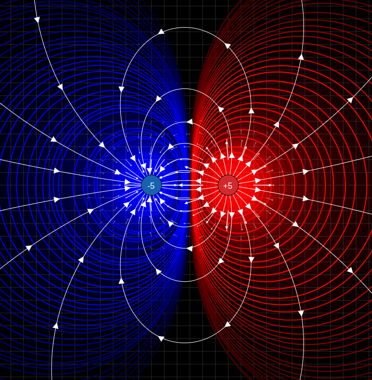

# Campo elétrico

# O que são campos?

---

Podemos definir **campos** na física como uma entidade física que permite a interação à distância entre corpos, ou seja, sem que haja nenhum tipo de contato físico entre eles. Matematicamente, podemos descrever campos como funções que recebem coordenadas temporais e no tempo e retornam números (no caso dos **campos escalares**) ou vetores (no caso dos **campos vetoriais**). 

## O campo elétrico

---

Quando estudamos o campo elétrico, vemos que ele é um **campo vetorial**, assim como o campo gravitacional: cada ponto do espaço ao redor da carga recebe um vetor de **força elétrica**. 

No caso das cargas positivas, convencionamos que o vetor aponta radialmente “para fora”, enquanto das cargas negativas, o vetor aponta radialmente “para dentro”. 

Visualmente, podemos “desenhar” o campo elétrico por meio das **linhas de força**, representações para os vetores de força de cada ponto do espaço considerado: a concatenação de vários vetores forma as linhas de força. Com vetores o suficiente, podemos desenhar “linhas” para representar o campo elétrico. 

Vale deixar claro que embora elas sejam chamadas “linhas de força”, nenhuma força é exercida em lugar nenhum **se não houver nenhuma outra carga para interagir com o campo**!

<i>Note como os vetores do campo elétrico mudam de direção de acordo com sua posição! Note também a intensidade do campo elétrico (ela decai de forma inversamente proporcional ao quadrado da distância). (Captura de tela desse <a href="https://icphysweb.z13.web.core.windows.net/simulation.html">simulador</a>).</i>

Essa imagem também evidencia uma informação muito útil se encontrarmos alguma linha de força de forma não muito padronizada: **o vetor campo elétrico** daquele ponto **é sempre tangente às linhas de força**, já que elas são formadas de muitos e muitos pequenos vetores de campo elétrico, um para cada ponto do espaço. 

# Intensidade de um campo elétrico

---

Para um ponto $(x,y,z)$ qualquer do espaço, podemos dizer que a **força eletrostática** (ou força coulombiana) que será exercida pelo vetor campo elétrico (criado por uma carga de valor $Q_1$) caso exista uma carga de valor $Q_2$ naquele ponto é dada por

$$
\vec{F_C}=k\frac{Q_1Q_2}{d^2}\bold{\hat{r}}
$$

Onde $\bold{\hat{r}}$ é o vetor campo elétrico unitário que sai de uma carga puntiforme radialmente.

Podemos plotar essas linhas de força mais complexas da figura acima calculando vários vetores (e subtraindo eles), dois para cada ponto do espaço (correspondente às duas cargas)! 

Uma maneira mais direta seria resolver as equações diferenciais de Maxwell, mas é fora do escopo deste documento.

Além disso, podemos comparar visualmente a intensidade de campos elétricos pela **densidade** de linhas de força. 

De forma mais geral, podemos medir o campo elétrico $\bold{E}$ pela unidade $\text{N/C}$ (Newtons por Coulomb), ou seja, quantos **Newtons de força serão exercidos para cada Coulomb de carga** que estiver naquele determinado ponto. Perceba que isso vem da própria definição do campo elétrico.

Dessa forma, podemos ainda encontrar uma segunda equação extremamente útil para a resolução de alguns problemas: 

$$
\bold{E}=\frac{\bold{F}}{q}\Rightarrow\bold{F}=q\bold{E}
$$

Também podemos encontrar uma outra equação para o **valor** do campo elétrico gerado por uma carga por meio de uma segunda adaptação da **Lei de Coulomb**, utilizando a equação encontrada acima. 

$$
\text {E} = \frac{F}{q} = \frac{kQq}{qd^2}\Rightarrow E=\frac{kQ}{r^2}
$$

Ou seja, podemos saber o **valor** do campo elétrico em $\text{N/C}$ de uma carga $Q$ em qualquer distância $r$!