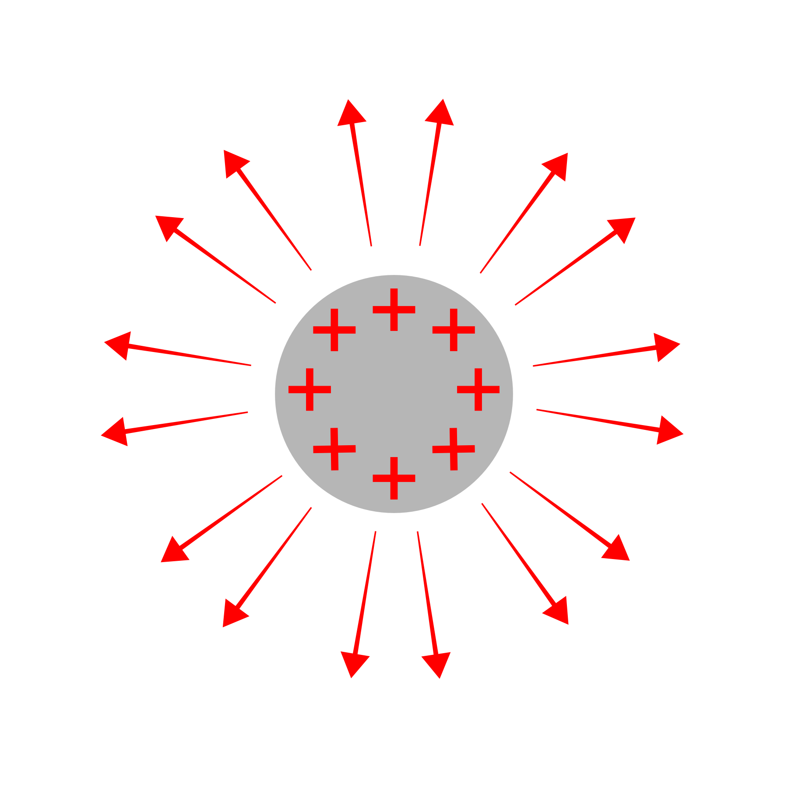

# Equilíbrio eletrostático

# A mágica dos condutores

---

Quando temos um **condutor eletrizado**, a tendência é que ele entre, eventualmente, em **equilíbrio eletrostático**. 

Um corpo estar em equilíbrio eletrostático significa que suas cargas não estão mais se movimentando, e isso nos fornece algumas informações:

1. O campo elétrico no interior desse corpo condutor é nulo (afinal, se tivesse campo as cargas estariam se movimentando, o que não é verdade); 
2. O potencial elétrico é sempre constante (afinal, se tivesse diferença de potencial teria movimentação de cargas, o que não acontece); 
    1. Logo a diferença de potencial, a **voltagem**, é sempre nula;
3. Cargas distribuídas na superfície possuem campos elétricos perpendiculares à ela; 
4. **Campos elétricos externos são anulados no interior do corpo**;

Uma esfera metálica carregada positivamente. Note as cargas distribuídas na superfície e o campo elétrico perpendicular. 

## Gaiolas de Faraday

---

Por que numa tempestade de raios é seguro correr para dentro de um carro? Ou então, qual o motivo de um avião conseguir levar uma descarga elétrica sem sofrer nenhum dano? Esse é o tema desse tópico, as **gaiolas de Faraday**. 

Essas estruturas são aplicações práticas dos princípios detalhados acima, permitindo que o interior de objetos condutores não sofra nenhuma consequência de descargas elétricas, pois qualquer campo elétrico externo é anulado no interior do condutor.

<i>GIF direto da Wikipédia! Preste atenção às cargas e ao campo! (Imagem sob domínio público, via <a href="https://commons.wikimedia.org/wiki/File:Faraday_cage.gif">Wikimedia Commons</a>)</i>

O GIF acima ilustra o funcionamento de uma gaiola de Faraday quadrada: o campo elétrico estimula a **redistribuição de cargas** no condutor até ele **atingir o equilíbrio eletrostático**. O **campo elétrico no interior da gaiola cessa**, note que as cargas ficaram nos lados opostos ao sentido do campo. 

<i>Uma demonstração de uma gaiola de Faraday num evento científico. Elas estão bem! (Imagem sob CC-BY-SA, via <a href="https://commons.wikimedia.org/wiki/File:Cage_de_Faraday.jpg">Wikimedia Commons</a>)</i>

Ou seja… você pode ficar tranquilo ao andar de avião numa tempestade! Os raios não são problema

## Campo e potencial elétricos

---

Num **corpo eletrizado e em equilíbrio eletrostático**, ao medirmos a intensidade do **campo elétrico** em função da distância do centro do corpo, considerado aqui como uma esfera por questões de simplicidade, temos que ele é **nulo no interior do corpo**, atingindo o valor máximo de $E_{max}=\dfrac{kQ}{R^2}$ um pouco acima da superfície do corpo (no *limite*, se você sabe, você sabe), enquanto na superfície a intensidade do campo vale metade, ou seja, $\dfrac{1}{2}E_{max}$. 

Além disso, como esperado, o valor da intensidade do campo decai normalmente a medida que nos afastamos do corpo pela conhecida função $\dfrac{kQ}{d^2}$.

Quando partimos para o **potencial elétrico** nessa mesma situação, ele será constante até a superfície (com ela inclusa), valendo $\dfrac{kQ}{R}$ e depois decairá normalmente em função da distância seguindo a função $\dfrac{kQ}{d}$. 

### Demonstração das expressões

---

<aside>

Em breve... 

</aside>

# Rigidez dielétrica

---

Vocẽ já deve ter lido, visto ou raciocinado que o ar da nossa atmosfera é isolante, certo? Se ele fosse condutor, teríamos que colocar tampas de borracha nas nossas tomadas para que elas não ficassem vazando nossa eletricidade assim como nós fechamos nossas torneiras. 

Mas aí surge uma dúvida, muito séria inclusive: **se o ar é isolante, como que os raios conseguem sair da nuvem até a Terra?**

E é daí que damos nossa partida para entender o importante conceito de **rigidez dielétrica** e que não existe isolante perfeito no Universo.

Todo material isolante possui essa propriedade, um dado “teto” de tensão que ele pode alcançar antes que ele se torne um condutor e permita a passagem de elétrons: esse acontecimento em inglês é chamado pelo nome chique de *electric breakdown*, e é (uma das) causa(s) dos famosos **curtos circuitos**. 

Ou seja, voltando para nossa pergunta dos raios… 

Eventualmente, a quantidade de cargas negativas nas nuvens vai ser tanta, mais tanta, que o campo elétrico entre a terra e as nuvens se tornará intenso o suficiente para que aconteça a quebra da rigidez dielétrica e uma descarga se forme, originando o **raio**.

A rigidez dielétrica de um dado material é medida em $V/m$, a **mesma unidade do campo elétrico** (pois é, $\text{E}$ pode ser medido tanto como $\text{N/C}$ como $\text{V/m}$). 

No caso do ar, sua rigidez dielétrica mede $3\times 10^6 \text{ V/m}$, ou seja, quando o campo elétrico excede esse valor, o **ar se torna um condutor e um raio acontece!**

# Densidade superficial de carga

---

A **densidade superficial de carga** $(\sigma)$ de um material mede, seguindo seu nome bem intuitivo, a *densidade* de carga na superfície de um corpo, ou seja, quantas cargas eu tenho por cada metro quadrado de área. Assim, $\sigma$ é medida em $\dfrac{C}{m^2}$. 

Essa medida serve para nos ajudar a entender o motivo de para-raios serem pontudos, por exemplo: **superfícies pontudas eletrizadas conservam mais carga em suas regiões pontudas**, por conta da geometria da situação: o corpo precisa entrar em equilíbrio eletrostático, com suas cargas livres precisando estar o mais afastadas possível entre elas próprias, porém as pontas forçam elas a se tornarem mais próximas. 

Mais cargas no mesmo lugar implica que o campo elétrico na superfície pontuda é maior, explicando o motivo dos raios preferirem locais não só altos, mas superfícies condutoras e pontudas. 

<i>Shazam! Em cidades com arranha-céus e outras estruturas altas e pontudas, é comum ver raios as atingindo (Imagem sob CC-BY-SA, via <a href="https://upload.wikimedia.org/wikipedia/commons/7/77/Funkturm_Arsenal_Blitze.jpg">Wikimedia Commons</a>).</i>