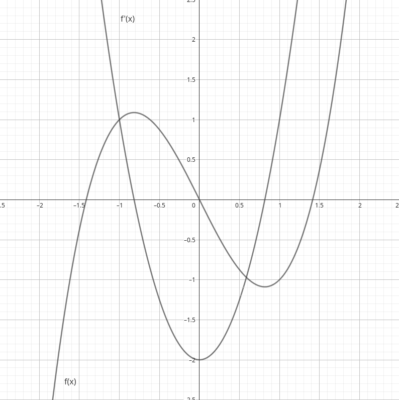
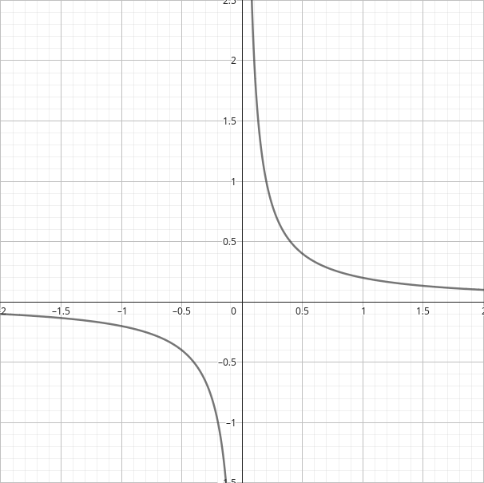
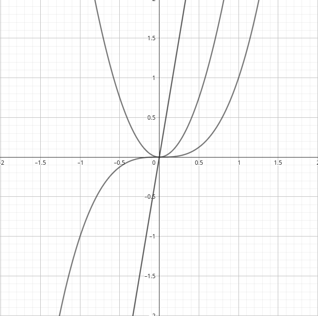

# Derivadas II — Aplicações 

# Teorema de Rolle & T.V.M.

O **teorema de Rolle**, também conhecido pela denominação **lema de Rolle** (em homenagem ao matemático francês <a href="https://en.wikipedia.org/wiki/Michel_Rolle" target="_blank">Michel Rolle</a>), é geralmente 

Dada uma função real $f$, contínua num intervalo fechado $[a,b]$ e diferenciável num intervalo $(a,b)$, de forma que $f(a)=f(b)$, existe um valor $c \in (a,b)$ de forma que $f'(c)=0$.

Geometricamente, podemos interpretá-lo como a afirmação de que existe um único ponto cuja reta tangente é paralela ao eixo das abscissas, consequência da interpretação geométrica das derivadas.

A motivação para esse teorema ser conhecido por **lema** (ou ”teorema auxiliar”) é a sua utilidade em demonstrar o **teorema do valor médio**. 

## Teorema do Valor Médio

---

O **teorema do valor médio** (**de Lagrange**) é tido como um dos mais importantes teoremas da análise real, estabelecendo que: 

Dada uma função real $f$, contínua num intervalo fechado $[a,b]$ e diferenciável num intervalo aberto $(a,b)$, onde $a<b$, existe um valor $c \in (a,b)$ de forma que

$$
f'(c)=\dfrac{f(b)-f(a)}{b-a}
$$

Esse teorema pode ser compreendido como uma generalização do teorema de Rolle, além de suas interpretações geométricas e físicas. Geometricamente, o Teorema do Valor Médio nos fornece as retas tangentes paralelas à secante entre os dois pontos $f(a)$ e $f(b)$; fisicamente, ele afirma que existe pelo menos um ponto em que a taxa de variação instantânea de uma quantidade foi igual a sua variação média.

Desse último caso, um exemplo muito palpável é o do velocímetro de um carro. Se numa viagem um automóvel teve uma velocidade média de 60 km/h, o TVM estabelece que houve pelo menos um instante em que o velocímetro marcou **exatamente 60 km/h**.

# Montando gráficos

---

Podemos esboçar gráficos de diversas funções reais utilizando consequências dos conceitos de derivadas e limites. O objetivo desta seção é esboçar algumas técnicas para que esse esboço se torne possível. Talvez não seja possível realmente desenhar o gráfico em todos os seus detalhes, mas a *noção* do comportamento da função estará no alcance de suas mãos. 

## Determinando porções crescentes e decrescentes

---

Como visto anteriormente, a interpretação geométrica da derivada é a inclinação da reta tangente a curva num determinado ponto. Se essa inclinação é negativa, significa que a função é **decrescente** naquela região; inclinações positivas implicam em funções crescentes num dado intervalo. Essa utilização é chamada geralmente de **teste da primeira derivada**.

<i>Perceba que $f'(x)$ é positiva quando a função está subindo e negativa quando o valor de $f(x)$ está caindo.</i>

## Pontos críticos

---

Chamamos **pontos críticos** os pontos do gráfico de uma dada função $f$ cuja derivada é nula ou inexistente. Uma derivada nula num determinado ponto implica num ponto de **mínimo** ou **máximo**. 

Os pontos de máximo ou mínimo podem ser locais ou globais. Os chamamos de locais quando estamos delimitando um subconjunto do domínio da função, enquanto os globais (também chamados **absolutos**) referem-se a todo o domínio.

Pontos de derivada inexistente implicam regiões de assíntotas verticais, quebras ou então cúspides.

<i>Uma assíntota vertical separa as duas "metades" das funções $(1/x)$. Em $x = 0$, a derivada não existe.</i>

## Teste da segunda derivada

---

Ao analisarmos a **segunda derivada** de uma função, podemos perceber que ela nos fornece o comportamento da primeira derivada. Por exemplo, vamos analisar a função $f(x)=x^3$ e suas duas primeiras derivadas.

<i>A primeira derivada é 3x^2, a segunda é 6x. Uma parábola e uma reta, respectivamente.</i>

Perceba que a segunda derivada é negativa enquanto a primeira está caindo e positiva enquanto a primeira está subindo. Além disso, existe um ponto, chamado **ponto de inflexão**, em que $f''(x)=0$, implicando na mudança de direção da primeira derivada. 

A partir dessas observações, podemos ver que as duas derivadas nos fornecem algumas informações sobre o comportamento da função $f$, como a categorização entre **crescente** e **decrescente** e se seu comportamento de crescimento ou decrescimento está acelerando ou retardando. Na Física, conhecemos a segunda derivada da função espaço vs tempo como **aceleração**.

# Taxas relacionadas

Os problemas de **taxas relacionadas** são problemas de cálculo relativamente comuns. Nesses problemas, temos taxas de variação produtos da mesma causa e, por isso, relacionadas entre si. 

Podemos citar como exemplo a questão abaixo, formulada pelo prof. Dr. José Carlos de Lima, do Instituto de Matemática da UFAL: 

<aside>

Bombeando o ar para dentro de um balão esférico, observamos que seu volume aumenta a uma taxa de $100 \text{ m}^3 \text{ / s}$. Quão rápido o raio do balão está aumentando quando o diâmetro do balão por 25 cm?

</aside>

Vamos anotar algumas informações. 

$$
\begin{align}

V(R)&=\dfrac{4}{3}\pi R^3 \\\\ 
\dfrac{dV}{dt}&=100 m^3 / s \\\\ 
\dfrac{dR}{dt} &= \text{ ?}

\end{align}
$$

A chave para a resolução desse problema e outros do mesmo tipo é o estabelecimento de relação entre essas taxas, explicitando a taxa procurada.

Derivando $(1)$ em relação a $t$, chegamos na expressão $\dfrac{dV}{dt}=4 \pi R^2 \dfrac{dR}{dt}$.

Como estamos procurando a taxa $\dfrac{dR}{dt}$ e já sabemos os outros dados na situação apresentada, podemos apenas substituir e encontrá-la. 

$$
\dfrac{dR}{dt}=\dfrac{100^3}{4\pi 25^2} = \dfrac{400}{\pi}
$$

Ou seja, quando o diâmetro do balão for 50 cm, seu raio está crescendo numa taxa de $400 / \pi$  centímetros por segundo.