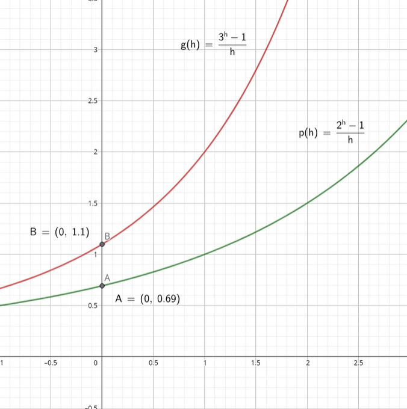

# Derivadas I — Conceitos 

# Introdução

---

<i>🎶🎹🎶🎹Próxima estação, next station, Butantã... (Imagem sob CC-BY-SA, via <a href="https://commons.wikimedia.org/wiki/File:Metro_de_S%C3%A3o_Paulo,_Luz_Station,_Brazil.jpg">Wikimedia Commons</a>)</i>

A linha 1-Azul do metrô de São Paulo, também conhecida como Linha Norte-Sul, é a mais antiga linha do sistema do metrô, inaugurada em 1974. Também é uma das maiores e mais movimentadas, com milhões de passageiros atravessando os 20 quilômetros de trilhos todos os dias pelos mais variados motivos. A capital não poderia viver sem ela. 

Sua extensão tem um preço: ela consegue ser extremamente lenta em horários de pico, mas incrivelmente rápida fora do <i>rush</i> — alguns minutos separam a "Liberdade" do "Paraíso".

Vamos imaginar que a coordenação do sistema mediu a **velocidade média** da linha, em horário de pico, como sendo aproximadamente 32 km/h. Por padrão, calculamos essa grandeza pela expressão:

$$
V_m=\dfrac{\text{Espaço percorrido}}{\text{Tempo gasto}}
$$

Podemos nos perguntar: seria essa medida realmente precisa? Ela realmente representa a velocidade do trem analisado pelo percurso? Bom, não necessariamente. O trem poderia estar mais devagar no começo, ou mais rápido no fim, ou o contrário, ou ainda ter demorado demais numa estação pela dificuldade em fechar as portas. 

A velocidade média é uma péssima medida se quisermos medir a velocidade do sistema em tempos específicos. 

Mas perceba que podemos tornar nossa medida cada vez melhor ao subdividir nossa medida em várias medidas com espaços de tempo cada vez menores: quanto menor o espaço de tempo considerado, mais próximos estaremos da velocidade real em torno de um instante específico. 

Essa visualização de uma **taxa de mudança** em tempos cada vez menores nos leva naturalmente ao conceito de **derivada**, que veremos adiante.

# Definição

---

Definimos derivada como o limite da **taxa de variação média** de uma função quando o intervalo $h$entre os valores da nossa variável (tempo, espaço, …) se torna cada vez mais próximo de zero, ou seja, estamos medindo o quão “sensível” a função é em resposta a uma pequena mudança no seu valor de entrada. 

De maneira mais formal, podemos definir que a derivada de uma certa função $f(x)$, denotada por $f'(x)$, é dada por:

$$
f'(x)=\lim_{h \rightarrow 0} \dfrac{f(x+h) - f(x)}{h}
$$

Perceba que esse limite nos retornará uma função cuja variável ainda é $x$:  no nosso exemplo acima, podemos calcular a velocidade da ferrovia em qualquer instante que quiséssemos.

Uma propriedade notável é que **toda função que é diferenciável**, isto é, possui uma derivada, é uma função contínua. O oposto, no entanto, nem sempre é verdade — muitas funções são contínuas mas não possuem derivadas, como por exemplo as **funções modulares**, que possuem limites laterais diferentes no ponto do “bico”.

<aside>

É importante salientar que é perfeitamente possível que a derivada de uma função seja também diferenciável. A derivada da derivada é chamada “derivada segunda” de $f$, denotada por $f''$ ou $f^{(2)}$. A derivada dessa derivada é a “derivada terceira” e assim por diante. 

</aside>

De forma geral, as três razões possíveis de uma função deixar de ser diferenciável num dado ponto são a presença de “bicos”, a descontinuidade de uma função naquele ponto ou ainda que a reta tangente no ponto analisado é uma reta vertical — razão que será justificada na seção seguinte.

## Interpretação geométrica

Ainda é possível uma interpretação geométrica da derivada — uma função que nos fornece o coeficiente angular da reta tangente à nossa função original em qualquer ponto que quisermos. Esse relacionamento pode ser deduzido a partir do próprio cálculo de um coeficiente angular dada uma reta e dois pontos: 

$$
m=\frac{y-y_0}{x-x_0}=\frac{\Delta y}{\Delta x}
$$

Percebe que o cálculo do coeficiente angular é uma taxa de variação entre $y$ e $x$?

## Interpretando o sinal da derivada

Dessa forma, se em um dado ponto $a$ temos $f'(a)>0$, podemos concluir que a função $f$ é **crescente em torno desse ponto**, pois a taxa de variação entre $y$ e $x$ é **positiva** — quando aumentamos $x$, aumentamos $y$.

O oposto acontece quando $f'(a)<0$, com $f$ decrescente em torno daquele ponto, característica indicada pela sua taxa de variação **negativa** — quando aumentamos $x$, diminuímos $y$.

O último caso, $f'(a)=0$, marca um ponto de **máximo**, **mínimo** ou ainda de **inflexão** — a mudança de $x$ não afeta $y$ nas proximidades daquele ponto. Veremos isso com mais detalhes adiante.

## Exemplos

---

Por fim, vamos a um exemplo! Qual seria a derivada da função $f(x)=x^2$? 

Nos utilizando da definição dada, podemos calcular o limite. 

$$
\begin{align*}
f'(x)&=\lim_{h \rightarrow 0} \frac{(x+h)^2 - x^2}{h}\\
f'(x)&=\lim_{h \rightarrow 0}\frac{x^2+2xh+h²-x²}{h}\\
f'(x)&=\lim_{h \rightarrow 0}\frac{h(2x + h)}{h}\\
f'(x)&=\lim_{h \rightarrow 0}2x+h\\
f'(x)&=2x
\end{align*}
$$

Esse padrão irá se repetir muitas vezes ao derivarmos pela definição — rearranjar a expressão com o objetivo de nos livrar do denominador $h$ e chegar numa expressão que, no final, podemos ignorar completamente essa variável, afinal, **ela tente à zero**, torna-se infinitamente pequena.

Que tal um outro exemplo, mais aplicado à realidade? Vamos dizer que numa vidraria é produzida uma certa quantidade $Q(t)$ (em kg) de vidro temperado, em função de um dado tempo $t$, em horas, aproximada pela função

$$
Q(t)=3t^2-10t
$$

Qual seria a **velocidade de produção** da fábrica? Podemos calcular a velocidade de produção em torno de um dado tempo derivando a função pela definição:

$$
\begin{align*}
Q'(t)&=\lim_{h \rightarrow 0} \frac{3(t+h)^2-10(t+h)-3t²+10t}{h}\\
Q'(t)&=\lim_{h \rightarrow0}\frac{3(t^2+2th+h^2)−10t−10h−3t^2+10t}{h}\\
Q'(t)&=\lim_{h \rightarrow 0}\frac{6ht+3h^2-10h}{h}\\
Q'(t)&=\lim_{h \rightarrow 0}6t-10+3h\\
Q'(t)&=6t-10
\end{align*}
$$

Ou seja, poderíamos dizer que a velocidade de produção é de $6t-10$ **quilogramas de vidro por hora** em um dado instante $t$. Por exemplo, quando $t=3$, temos que a velocidade é de

$$
Q'(3)=6 \times 3 - 10 = 8 \text{kg/h}
$$

Em outro instante, por exemplo, quando $t=1$,

$$
Q'(1)=-4 \text{kg/h}
$$

Uma produção que na verdade perde quilos de vidros a cada hora, indicando, talvez, perda de material ou uma paralisação por algum outro motivo.

# Regras de derivação

---

É perceptível que se utilizar da definição de derivação sempre que se fazer necessário calcular uma derivada é algo trabalhoso e demorado. Por isso, podemos nos utilizar das **regras de derivação**, propriedades do cálculo de derivadas — muitas delas derivadas das propriedades de limites — que facilitam nosso trabalho e diminuem nosso esforço.

## Derivada de uma função constante

---

A primeira dessas propriedades, e provavelmente a mais direta, é que a derivada de uma função constante é nula.

De fato, sendo $f(x)=c$, podemos deduzir — a título de curiosidade —, essa propriedade da seguinte maneira: 

$$
f'(x)=\lim_{h \rightarrow 0} \frac{f(x+h) - f(x)}{h} = \lim_{h \rightarrow 0} \frac{c - c}{h} = \lim_{h \rightarrow 0} \frac{0}{h}=0
$$

## Função potência

---

Dada uma função $f(x)=x^n$, sua derivada será $f'(x)=nx^{n-1}$ para todo $n \in \mathbb{R}$. 

Por exemplo, dada uma função $f(x)=x^4$, sua derivada será $f'(x)=4x^3$. 

É possível demonstrar a validade dessa afirmação para $n \in \N$ pelo binômio de Newton e jogos de álgebra, tanto para $n \in \mathbb{R}$ por meio da **diferenciação implícita** e da **diferenciação logarítmica**, mostradas mais adiante. 

### Prova 1 — Binômio de Newton

Seja $f(x)=x^n$ uma função. Por definição, temos que sua derivada $f'(x)$ é dada pelo limite:

$$
f'(x)=\lim_{h \rightarrow 0} \dfrac{(x + h)^n - x^n}{h}
$$

Expandindo o minuendo do numerador por meio do binômio de Newton, temos que: 

$$
\begin{align*}
(x+h)^n &= {n \choose 0}x^n + {n \choose 1}x^{n-1} \cdot h + {n \choose 2} x^{n-2} \cdot h^2 + ... + {n \choose n} h^n \\ 
&= \dfrac{n!}{0!(n-0)!} x^n + \dfrac{n!}{1!(n-1)!}x^{n-1}\cdot h + \dfrac{n!}{2!(n-2)!}
\cdot h^2 + ...+ \dfrac{n!}{n!(n-n)!} \cdot h^n \\ 
&= \dfrac{n!}{n!} x^n + \dfrac{n!}{(n-1)!} x^{n-1} \cdot h + \dfrac{n!}{2(n-2)!} \cdot h^2 + ... + h^n \\ 
&= x^n + nhx^{n-1} + \dfrac{n!}{2(n-2)!} \cdot h^2 + ... + h^n
\end{align*}
$$

Substituindo a expansão no numerador do limite original, temos: 

$$
\begin{align*} 
(x+h)^n - x^n &= x^n + nhx^{n-1} + \dfrac{n!}{2(n-2)!} \cdot h^2 + ... + h^n - x^n \\ 
&= nhx^{n-1} + \dfrac{n!}{2(n-2)!} \cdot h^2 + ... + h^n

\end{align*}
$$

Colocando $h$ em evidência e simplificando a fração, chegamos no limite: 

$$
\lim_{h \rightarrow 0} nx^{n-1} = nx^{n-1}
$$

Como queríamos demonstrar.

### Prova 2 — Diferenciação implícita e logarítmica

Seja $f(x)=y=x^n$. Logo, temos que: 

$$
\begin{align*}
\ln y &= \ln x^n \\\\
\ln y &= n \ln x \\\\ 
\dfrac{y'}{y} &= n\cdot \dfrac{1}{x} \\\\ 
y' &= y \cdot \dfrac{n}{x} \\\\  
y' &= nx^{n-1}
\end{align*}
$$

Como queríamos demonstrar. Os conceitos de derivação implícita e derivação logarítmica estão descritos mais adiante nesta seção.

## Multiplicação por uma constante

Dadas duas funções $g(x)$ e $f(x)$ e uma constante $c \in \mathbb{R}$, de forma que $g(x)=cf(x)$, a derivada de $g(x)$ é dada pelo produto entre $c$  e $f'$. 

Essa propriedade pode ser demonstrada de forma relativamente simples. 

$$
\begin{align*}
g'(x)&=\lim_{h \rightarrow 0} \frac{g(x+h)-g(x)}{h}=\lim_{h \rightarrow 0} \frac{cf(x+h) - cf(x)}{h}\\
&= \lim_{h \rightarrow 0}\frac{c[f(x+h) - f(x)]}{h}=c\lim_{h \rightarrow 0} \frac{f(x+h)-f(x)}{h}=cf'(x)
\end{align*}
$$

Perceba que a última afirmação é dada por meio de propriedades de limites — a constante “sai”.

## Regra da soma ou da diferença

---

Ao derivarmos uma função formada pela soma, ou pela diferença, de duas outras funções, sua derivada será a soma (ou a diferença) das derivadas das funções que a formam, isto é

$$
F(x)=f(x) \pm g(x) \Rightarrow F'(x)=f'(x) \pm g'(x)
$$

## Regra do produto

---

Quando derivamos uma certa função $F(x)$ composta pelo produto de outras duas funções, a saber, $f(x)$ e $g(x)$, podemos dizer: 

$$
F'(x)=f'(x)g(x)+f(x)g'(x)
$$

Essa propriedade pode ser demonstrada pela definição de derivada — simplificações e expansões das expressões. 

## Regra do quociente

---

Para encontrar a derivada de uma certa função $F(x)=\dfrac{f(x)}{g(x)}, g(x) \neq 0$, temos que 

$$
F'(x)=\dfrac{g(x)f'(x)-f(x)g'(x)}{[g(x)]^2}
$$

Essa regra pode ser demonstrada a partir da regra do produto de maneira relativamente direta. Pode também ser demonstrada pela definição de derivada de uma maneira robusta. 

## Regra da cadeia

---

A regra da cadeia possui uma demonstração matemática mais complexa, mas uma utilidade imensa, servindo de base para a resolução de problemas como por exemplo a derivação de funções exponenciais, explorada mais adiante — essa propriedade nos permite encontrar a derivada de funções compostas.

Dada uma função $F(x)=(f \circ g)(x) = f(g(x))$, temos que sua derivada é dada por

$$
F'(x)=f'(g(x)) \cdot g'(x)
$$

<aside>

Daqui em diante é interessante a utilização da notação de Leibnitz em algumas — várias — situações pela sua maior densidade informacional. Se não estiver familiarizado com a notação batizada em sua homenagem, vá para o apêndice ao final desse documento e depois retorne aqui.

</aside>

Ou ainda, de forma provavelmente mais didática: 

$$
\dfrac{dy}{dx}=\dfrac{dy}{du} \cdot \dfrac{du}{dx}
$$

Com $y$ sendo minha função original, $u$ sendo a minha função “interna”, tratada como variável, e finalmente $x$, a minha verdadeira variável. 

### Exemplo

---

Definindo a função $y=f(x)=\sqrt{5x-8}$, podemos encontrar sua derivada através da regra da cadeia. 

Neste exemplo, chamamos $u=5x-8$. Assim, pela regra da cadeia: 

$$
\begin{align*}
\dfrac{dy}{dx}=\dfrac{dy}{du} \cdot \dfrac{du}{dx} &= \dfrac{1}{2}u^{-1/2} \cdot 5 \\ 
&= \dfrac{1}{2} \cdot \dfrac{1}{\sqrt{5x - 8}} \cdot 5 \\ 
&= \dfrac{5}{2\sqrt{5x-8}}
\end{align*}
$$

# Derivando funções exponenciais

---

As funções exponenciais formam um problema único no estudo do cálculo, pois obter sua derivada mostra-se algo um pouco mais complexo, que iremos abordar ao longo dessa seção.

Antes de tudo, chamamos função exponencial toda função $f(x)=b^x$, com $b > 0$ e $b \neq 1$. 

Tendo isso em mente, vamos tentar derivá-la por meio da definição. Assim, temos que: 

$$
\begin{align*}
f'(x)&=\lim_{h \rightarrow 0} \frac{b^{x + h} - b^x}{h}\\
&=\lim_{h \rightarrow 0} \frac{b^x \cdot b^h - b^x}{h}\\
&=b^x \cdot \lim_{h \rightarrow 0}\frac{b^h - 1}{h}

\end{align*}
$$

Perceba que não temos informação o suficiente para derivar uma função exponencial de base qualquer pois ainda não sabemos como calcular o último limite — só temos uma única informação, **ele é uma constante**, o limite não depende de $x$. 

Chegamos ao fato de que o limite dessa função é proporcional a uma constante que não sabemos, ainda, seu valor. Chegamos a uma barreira.

Para derrubá-la, vamos primeiro imaginar duas bases, a saber, $b_1 = 2$ e $b_2 = 3$. Iremos substituí-las na função do interior do limite que não conseguimos resolver. 

Assim, definimos duas funções, $p(h)$ e $g(h)$, com $b=b_1$ e $b=b_2$, respectivamente. 

Note que quando calculamos o limite dessas duas funções, $\lim_{h \rightarrow 0} p(h)$ e $\lim_{h \rightarrow 0} g(h)$, ambos são bem próximos de 1, sugerindo a existência de uma base cujo limite é exatamente esse valor. 

Vamos batizar essa base **especial** chamando-a $e$.

Na matemática, esse número é conhecido por **número de Euler** ou **número neperiano**, em homenagem aos matemáticos Leonhard Euler e John Napier.

<i>Seria super conveniente...</i>

Seria conveniente utilizar $e$ como nossa base, pois nossa expressão original, complicada, se tornaria algo simples e prático. 

Dessa forma, quando $b=e$, o limite se torna:

$$
\begin{align*}
f'(x)&=e^x \cdot \lim_{h \rightarrow 0} \frac{e^h-1}{h} \\\\
&=e^x
\end{align*}
$$

Ou seja, a derivada da **função exponencial natural** — $f(x)=e^x$ — é ela própria. 

“Mas e as outras bases?”, alguém pode se questionar, mas não se preocupe, pois esse número que encontramos é justamente a chave que irá permitir a superação de nossa barreira no cálculo da derivada de uma exponencial qualquer. 

E se reescrevêssemos nossa função exponencial de base geral **mudando a sua base** para nosso número especial? Isso pode ser feito da seguinte maneira:

$$
b^x=(e^{\log_e{b}})^x
$$

Lembrando que isso pode ser feito por uma propriedade fundamental dos logaritmos: $p^{\log_p{k}}=p$.

Voltando a nossa igualdade original, podemos continuar a simplificá-la:

$$
\begin{align*}
b^x&=(e^{\log_e{b}})^x\\
&=e^{x \cdot \log_e{b}}\\
&=e^{x \cdot \ln{b}}
\end{align*}
$$

<aside>

Podemos reescrever $\log_e$ como $\ln$ — o logaritmo natural. 

</aside>

Todo esse processo de reescrita foi para possibilitar a aplicação da regra da cadeia em nossa função. Assim, derivando $b^x$ pela regra da cadeia, nós obtemos que: 

$$

\begin{align*}
    \dfrac{d}{dx}(b^x)&=\dfrac{d}{dx}(e^{x \cdot \ln{b}}) \\\\
    &=e^{x \cdot \ln{b}} \cdot \ln b \\\\
    &= b^x \cdot \ln b
\end{align*}

$$

Conseguimos o que queríamos! 

Por fim, é importante salientar que este resultado é também válido para qualquer função $b^{f(x)}$, isto é:

$$
\dfrac{d}{dx}b^{f(x)}=b^{f(x)} \cdot  \ln{b} \cdot f'(x)
$$

Essa regra será bastante útil em situações de funções exponenciais compostas. 

# Derivando funções logarítmicas

---

Podemos denominar **função logarítmica** toda função $f(x)=\log_bx$, com todas as restrições numéricas necessárias para que o logaritmo exista, como por exemplo, que $b>0$ e $b\neq 1$. 

Por meio da **derivação implícita**, técnica que veremos adiante, podemos encontrar que as derivadas das funções logarítmicas são da forma:

$$
f'(x)=\frac{1}{x \cdot \ln b}
$$

Por exemplo, quando $b=e$, temos que $f'(x)=\dfrac{1}{x}$.

# Derivadas de funções trigonométricas

---

Todas as funções trigonométricas podem ser reconstruídas por meio de recombinações das funções seno e cosseno. Tendo isso em vista, abaixo estarão as suas derivadas pela definição e em seguida uma lista das derivadas das outras funções.

## Derivando a função seno

---

Pela definição, temos: 

$$
\dfrac{d}{dx}\sin x =\lim_{h \rightarrow 0} \frac{\sin{(x + h)-\sin x}}{h}
$$

Utilizando a propriedade trigonométrica do seno da soma, obtemos: 

$$
\begin{align*}
\dfrac{d}{dx} \sin x &=\lim_{h \rightarrow 0} \frac{\sin x \cos h+\sin h \cos x - \sin x}{h}\\
&=\lim_{h \rightarrow 0} \left(\dfrac{\sin h}{h}\cos x + \dfrac{\cos h -1}{h} \sin x \right)\\
\end{align*}
$$

Por fim, aplincando os limites fundamentais da trigonometria, cujas provas podem ser encontradas [**neste artigo**](https://en.wikipedia.org/wiki/Differentiation_of_trigonometric_functions) da Wikipedia, obtemos finalmente que:

$$
\dfrac{d}{dx}\sin x=1\cdot \cos x + 0 \cdot \sin x = \cos x
$$

## Derivando a função cosseno

---

Seguindo um caminho semelhante à seção anterior, pela definição, temos que: 

$$
\dfrac{d}{dx}\cos x = \lim_{h \rightarrow 0} \frac{\cos{(x + h)} - \cos x}{h}
$$

Por meio da identidade do cosseno da soma, podemos reescrever: 

$$
\begin{align*}
\dfrac{d}{dx}\cos x &= \lim_{h \rightarrow 0} \dfrac{\cos x \cos h - \sin x \sin h - \cos x}{h}\\
&= \lim_{h \rightarrow 0} \left(\dfrac{\cos h - 1}{h} \cos x - \dfrac{\sin h}{h} \sin x \right)
\end{align*}
$$

Por fim, pelos limites mencionados na seção anterior, podemos concluir nossa demonstração. 

$$
\dfrac{d}{dx}\cos x = 0 \cdot \cos x - 1 \cdot \sin x = - \sin x
$$

## Outras funções trigonométricas

---

Para essas outras funções, expostas na tabela ao lado, as demonstrações de suas derivadas podem ser realizadas por meio das regras como a do quociente ou do produto, o que não será feito aqui por questões de brevidade. 

$$
\begin{array}{|c | c |}
\hline
\textbf{ Função } & \textbf{ Derivada }\\
\hline
\sin x & \cos x\\
\hline
\cos x & -\sin x \\
\hline
\tan x & \sec^2x \\
\hline
\cot x & -\csc^2x\\
\hline
\sec x & \sec x \tan x \\
\hline 
\csc x & -\csc x \cot x \\
\hline
\end{array} 
$$

## Funções trigonométricas inversas

---

$$
\begin{array}{| c | c |}
\hline
\textbf{ Função } & \textbf{ Derivada }\\
\hline
\\
\sin^{-1} x & \dfrac{1}{\sqrt{1 - x^2}}\\
\\
\hline
\\
\cos^{-1} x & -\dfrac{1}{\sqrt{1 - x^2}} \\
\\
\hline
\\
\tan^{-1} x & \dfrac{1}{x^2 + 1} \\
\\
\hline
\\
\cot^{-1} x & - \dfrac{1}{x^2+1}\\
\\
\hline
\\
\sec^{-1} x & \dfrac{1}{|x|\sqrt{x^2-1}}
\\
\\
\hline 
\\
\csc^{-1} x & - \dfrac{1}{|x| \sqrt{x^2-1}}
\\
\\
\hline
\end{array} 
$$

As derivadas das funções trigonométricas inversas, dispostas na tabela ao lado, podem ser demonstradas por meio da técnica da **derivação implícita**, tema da próxima seção. Suas provas também podem ser consultadas no artigo da Wikipedia citado anteriormente — elas estão bem detalhadas. 

Perceba ainda que metade das derivadas é a mesma função que a outra metade, porém com o sinal oposto, por exemplo:

$$
\begin{align*}
\frac{d}{dx} \tan^{-1} x &= \frac{1}{x^2 + 1}
\\
\\
\frac{d}{dx} \cot^{-1} x &= -\frac{1}{x^2 + 1}
\end{align*}
$$

Note ainda que as funções trigonométricas e suas inversas apresentam um padrão interessante: os pares de derivadas costumam ser parecidos, mas com sinais opostos — padrão com origem na relação entre essas funções no círculo trigonométrico.

É importante ainda deixar claro que essas derivadas só são válidas onde as funções estão definidas, por exemplo, $\sin^{-1} x$ está definida apenas no intervalo $[-1, 1]$.

# Práticas, regras e técnicas úteis 

Esta seção servirá como um compêndio de algumas regras, técnicas e práticas que podem ser úteis em algumas situações, acelerando o processo de derivação e economizando tempo e esforço. 

## Derivação implícita

---

A **derivação implícita** é uma técnica muito útil para derivar funções oriundas de equações que relacionam $x$ e $y$, pois nem sempre é fácil escrever $y$ diretamente em função de $x$. Quando isso acontece, precisamos usar a derivação implícita: derivamos os dois membros da equação em relação a $x$ enquanto tratamos $y$ como uma função de $x$ ainda desconhecida.

Por exemplo, considere a equação $x^2+y^2=1$, a equação de um círculo. É fácil ver que podemos explicitar $y=f(x)$ por meio de uma simples reescrita: 

$$
x^2+y^2 = 1 \Rightarrow y = \sqrt{1-x^2}
$$

Mas e se tivermos uma equação como $\sin{(x+y})=y²\cos{x}$? Nesse caso, como encontrar a derivada de $y$? Começaremos derivando ambos os membros em relação a $x$.

$$
\begin{align*}
\dfrac{d}{dx}(\sin{(x+y)})&=\dfrac{d}{dx}(y^2 \cos x)\\
\cos{(x+y)} \cdot (1 + y') &= 2y \cdot y' \cos{x} + y^2 (- \sin x)\\
\cos{(x+y)} + \cos{(x+y)}y' &= 2y \cos{x} \cdot y' - y^2 \sin{x}\\
\end{align*}
$$

Perceba que sempre aplicamos a regra da cadeia ao derivarmos uma expressão que envolve $y$, pois ela é uma função de $x$. 

$$
\begin{align*}
[\cos{(x+y)} - 2y \cos{x}]y' &= -y^2 \sin{x} - \cos{(x+y)}\\
y'&=\dfrac{y^2 \sin{x} + \cos{(x+y)}}{2y\cos{x} - \cos{(x+y)}}
\end{align*}
$$

Essa estratégia de derivação se mostra muito útil em problemas das mais variadas áreas, como Física, Química e Economia — quando sabemos a relação entre as variáveis de forma implícita, e seria trabalhoso demais colocar uma em função da outra. 

Se quisermos encontrar a expressão original de $y$, poderemos nos utilizar das técnicas de integração e equações diferenciais, que veremos no decorrer dos próximos cursos — livretos — de Cálculo.

## Derivação logarítmica

---

A **derivação logarítmica** é uma prática muito eficiente quando se mostra necessário derivar funções formadas por uma grande quantidade de expressões, mais comumente produtos, quocientes e potências. 

Ela consiste apenas em aplicar o logaritmo natural na equação da função, simplificar e derivar implicitamente, extraindo a derivada ao final. 

Por exemplo, vamos encontrar a derivada da função $f(x)=\dfrac{x²\sqrt[3]{5x-10}}{(x-2)^2}$.

Primeiro, vamos aplicar o logaritmo natural nos dois lados da equação e simplificar: 

$$
\begin{align*}
\ln|y|&=\ln\left|\dfrac{x^2 \sqrt[3]{5x-10}}{(x-2)^2}\right|\\
&=\ln|x² \cdot \sqrt[3]{5x-10}| - \ln|(x-2)^2|

\end{align*}
$$

Perceba que estamos considerando o **módulo da expressão** pois a função logaritmo não está definida para números negativos. 

$$
\begin{align*}
\ln |y|&= \ln |x²|+\ln|\sqrt[3]{5x-10}| - 2\ln|x-2|\\
\ln |y|&= 2\ln|x| + \dfrac{1}{3} \ln |5x-10| - 2\ln|x-2|\\

\end{align*}
$$

Com a expressão simplificada, derivamos ambos os lados da equação em relação a $x$. 

$$
y' \cdot \dfrac{1}{y}=2 \cdot \dfrac{d}{dx} \ln x + \dfrac{1}{3} \cdot \dfrac{d}{dx} \ln(5x-10) - 2 \cdot \dfrac{d}{dx}\ln (x-2)
$$

Perceba que ignoramos completamente a função módulo necessária depois da derivada: o motivo está na derivação de $\ln|y|$.

Ao derivar $\ln |y|$, a regra da cadeia nos dá:

$$
\dfrac{d}{dx}\ln |y| = \dfrac{1}{|y|} \cdot \text{sgn}(y) \cdot y'
$$

Mas como $\dfrac{1}{|y|} \cdot \text{sgn}(y)=\dfrac{1}{y}$, temos que o resultado final simplifica para $\dfrac{1}{y} \cdot y'$.

Essa relação é válida para os casos de $y > 0$ e $y < 0$ — quando $y=0$, a derivada não existe.

Finalizando essa observação importante e retornando ao objetivo principal, podemos pela regra da cadeia encontrar as derivadas procuradas e continuar a simplificação.

$$
\begin{align*}
y' \cdot \dfrac{1}{y} &= 2 \cdot \dfrac{1}{x} + \dfrac{1}{3} \cdot \dfrac{1}{5x-10} \cdot 5 - 2 \cdot \dfrac{1}{x-2}\\
&= \dfrac{2}{x} + \dfrac{1}{3(x-2)} - \dfrac{2}{x-2}\\
&= \dfrac{2}{x} - \dfrac{5}{3(x-2)}\\
\end{align*}
$$

Por fim, multiplicando ambos os lados por $y$: 

$$
\begin{align*}
y'&=\left(\dfrac{x^2 \sqrt[3]{5x-10}}{(x-2)^2}\right)\left(\dfrac{2}{x} - \dfrac{5}{3(x-2)}\right)\\
y'&= \dfrac{2x \sqrt[3]{5x-10}}{(x-2)^2} - \dfrac{5x^2 \sqrt[3]{5x-10}}{3(x-2)^3} \\
y'&= \dfrac{(6x^2-12x) \cdot \sqrt[3]{5x-10}-5x² \sqrt[3]{5x-10}}{3(x-2)^3}\\
y'&= \dfrac{(x^2-12x) \cdot \sqrt[3]{5x-10}}{3(x-2)^3}
\end{align*}
$$

Veja como essa técnica poupou tempo ao evitar que aplicássemos repetidas vezes as regras do produto, quociente e da cadeia! 

## Regra de L’Hôpital

---

Enquanto o simples rearranjo algébrico pode levantar indeterminações em alguns limites, a **regra de L’Hôpital** nos ajuda a tratar de forma simples dois tipos de indeterminações, a saber, as de tipos $\frac{0}{0}$ ou $\frac{\infty}{\infty}$. 

A regra estabelece que, se supormos duas funções, $f(x)$ e $g(x)$, diferenciáveis em um intervalo aberto $I$, com $g'(x) \neq 0$ — exceto em um dado $a \in I$, possivelmente —, e uma das seguintes situações ocorrerem,

$$
\begin{array}{ccc}
\lim_{x \rightarrow a} f(x) = 0 & \text{e} &\lim_{x \rightarrow a} g(x)=0\\
\\
& \text{ou} &
\\
\\
\lim_{x \rightarrow a} f(x) = \pm \infty & \text{e} &\lim_{x \rightarrow a} g(x)= \pm\infty,
\end{array}
$$

podemos concluir que $\lim_{x \rightarrow a} \dfrac{f(x)}{g(x)} = \lim_{x \rightarrow a} \dfrac{f'(x)}{g'(x)}$.

Para fins ilustrativos, vamos cálcular o seguinte limite: $\lim_{x \rightarrow 2} \dfrac{x - 2}{x^2 - 4}$. 

Podemos perceber que se substituirmos diretamente, teremos uma indeterminação do tipo $\frac{0}{0}$. O próximo passo é derivar o numerador e o denominador, para levantar essa indeterminação. Derivando-os, chegamos em: 

$$
\begin{align*}
\lim_{x \rightarrow 2} \dfrac{1 - 0}{2x - 0} &= \lim_{x \rightarrow 2} \dfrac{1}{2x}\\
&= \dfrac{1}{2(2)}\\
&=\dfrac{1}{4}
\end{align*}
$$

Simples, prático, eficiente. Essa regra é extremamente útil, e irá nos poupar horas de trabalho.

# Apêndice: notações para derivada

---

Ao longo dos anos, diversas notações para representar a função derivada foram desenvolvidas, com as mais conhecidas sendo as de **Newton**, **Leibnitz** e **Lagrange**. Enquanto a primeira é utilizada mais nos campos da Física, as duas últimas são mais gerais, podendo ser encontradas em uma variedade de contextos.

A notação de Newton, nomeada em homenagem a Isaac Newton, físico inglês, é comumente utilizada na física para representar as funções derivadas de uma função cujo domínio é o tempo. 

Por exemplo, sendo $y(t)$ uma função da altura de um corpo no decorrer do tempo, $\dot{y}$ seria sua primeira derivada — a velocidade — e $\ddot{y}$ sua segunda derivada, a aceleração. Por praticidade, essa notação não é muito utilizada para derivadas de ordem superior. 

Uma notação um pouco mais explícita é a de Lagrange. Para uma certa função $f(x)$, escrevemos sua derivada de primeira ordem como $f'$ ou $f^{(1)}$, a de segunda ordem como $f''$  ou $f^{(2)}$ e assim por diante. É um meio termo entre as notações de Newton e Leibnitz. 

Por sua vez, a notação de Leibnitz é a mais explícita e detalhada de todas as comumente utilizadas, identificando inclusive a variável que a função está sendo derivada. Para uma certa função $f(x)$, podemos denotar sua derivada em relação à variável $x$ por $\dfrac{df}{dx}$ ou $\dfrac{d}{dx}f(x)$.