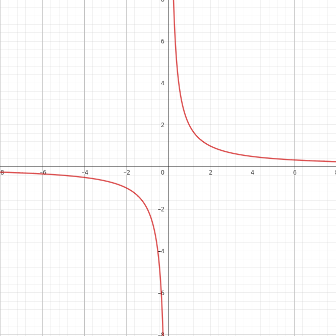
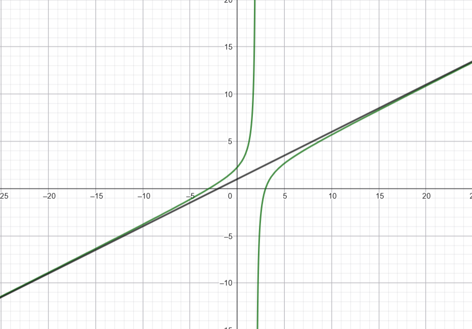

# Limites

# Definição

---

Todo o nosso entendimento do Cálculo se apoia no conceito de **limites**.

Uma definição possível que poderíamos escrever aqui seria a famosa **épsilon-delta**, porém ela é de certa forma muito complicada para nós que acabamos de entrar nessa aventura, por isso, vamos para uma outra abordagem.

Definimos o **limite** de uma função $f(x)$ como o número em que podemos tornar o valor da função o quão próximo quanto quisermos dele, sem necessariamente ela o assumir. 

Podemos representar essa quantidade por meio da notação 

$$
\lim_{x \rightarrow a} f(x)=L
$$

e lemos assim: “O limite da função $f$ é igual a $L$, quando $x$ tende para $a$”. 

Vale lembrar que estamos assumindo algumas coisas aqui, como o fato de $f$ ser uma função com domínio e contradomínio na reta dos números reais.

<aside>
Num primeiro momento, nossa única ferramenta no cálculo desses limites é a **aproximação numérica** e, por consequência, a **interpretação de gráficos**.
Isso mudará quando virmos algumas propriedades de limites, e poderemos calculá-los sem (muito) esforço.
</aside>

## Limites laterais

---

Os **limites laterais** são uma especificidade que nasce da noção de aproximação entre $x$ e $a$. 

Como estamos tratando de uma reta real, podemos aproximar os dois números com $x>a$, assumindo valores cada vez menores — e mais próximos da nossa constante —, ou obedecendo à restrição de que $x < a$, em que a variável irá assumir valores cada vez maiores.

O primeiro caso é chamado de **limite a direita**, enquanto o segundo é chamado de **limite a esquerda**. Seus nomes vêm das seções da reta real que $x$ percorre quando se aproxima de $a$.

Em questão de notação, denotamos, respectivamente:

$$
\lim_{x \rightarrow a^+} f(x)=L
$$

$$
\lim_{x \rightarrow a^-} f(x)=L
$$

Perceba os sinais de adição e subtração sob o $\lim$: eles nos indicam a direção do limite lateral — números “maiores” e “menores”.

Esses limites nos são úteis por um teorema que estabelece que a **existência (e igualdade) de ambos os limites laterais** implica na **existência do limite padrão**, ou seja

$$
\exists \lim_{x \rightarrow a} f(x) \Leftrightarrow \lim_{x \rightarrow a^+} f(x) = \lim_{x \rightarrow a^-} f(x)
$$

# Propriedades

---

Como dito anteriormente, as propriedades de limites nos serão muito úteis para calculá-los sem a necessidade de gráficos ou tediantes aproximações numéricas. Aqui estão reunidas todas, ou pelo menos as mais importantes, em ordem crescente de complexidade. 

## Limite de uma constante

---

Se tivermos em mãos uma função constante $f(x)=C, \forall{x} \in \mathbb{R}$, saberemos que seu limite é $C$ para todo par $x, a \in \mathbb{R}$ escolhido, ou seja:

$$
\lim_{x \rightarrow a} f(x)=C, \forall x, a \in \mathbb{R}
$$

Ainda, de forma mais sucinta, podemos dizer que “o limite de uma constante é a própria constante” — é bem intuitivo, já que a função não muda para qualquer valor escolhido.

## Limite da soma e da diferença

---

Dadas duas funções $f(x)$ e $g(x)$, ambas possuindo seus respectivos limites num dado número $a$ — o que também assumiremos para as próximas seções —, isto é: 

$$
\lim_{x \rightarrow a} f(x)=L_1
$$

$$
\lim_{x \rightarrow a} g(x)=L_2
$$

Temos que o **limite de sua soma** é a soma dos seus limites, assim, podemos escrever

$$
\lim_{x \rightarrow a} [f(x)+g(x)]=L_1+L_2
$$

De forma análoga, podemos escrever que **o limite de sua diferença** é a diferença de seus limites:

$$
\lim_{x \rightarrow a} [f(x)-g(x)]=L_1-L_2
$$

## Limite de um produto

---

O limite do produto de duas funções é o produto de seus limites.

$$
\lim_{x \rightarrow a} [f(x) \cdot g(x)]=L_1 \cdot L_2
$$

Se assumirmos uma das funções como **constante**, teremos que

$$
\lim_{x \rightarrow a} [c \cdot f(x)]=cL_1
$$

e ainda podemos dizer que o limite de uma potência é a potência do seu limite: 

$$
\lim_{x \rightarrow a} [f(x)^n]=L_1^n
$$

## Limite de um quociente

---

O limite da razão entre $f$ e $g$ é o quociente entre os limites de cada uma, ou seja:

$$
\lim_{x \rightarrow a} \left[\frac{f(x)}{g(x)}\right]=\frac{L_1}{L_2}
$$

Claro, para isso precisamos que $g(x), L_2 \neq 0$.

## Limite de um polinômio

---

Essa, provavelmente, é uma das propriedades mais úteis de toda essa lista, sendo construída a partir das anteriores de forma elegante — tente demonstrar ela no papel aplicando as propriedades de limite da soma, limite de potência e limite de uma constante nos termos do polinômio e simplificando.

Temos que o limite de um polinômio $p(x)$ num dado número $a$ é o mesmo que calcular $p(a)$.

## Limite de uma função racional

---

Por fim, se $f$ e $g$ forem polinômios e $F$ for uma função racional, isto é, uma função formada pela razão entre os dois polinômios dados,

$$
F(x)=\frac{f(x)}{g(x)}
$$

podemos concluir, pelas propriedades de **limite de um polinômio** e **limite de um quociente**, que

$$
\lim_{x \rightarrow a} F(x)=F(a)
$$

Se possível, tente provar essa propriedade também! É interessante ver como tudo se encaixa.

# Indeterminações

---

Muitas vezes, ao tentarmos calcular o limite de uma dada expressão, caímos em indeterminações dos mais variados tipos, como $\dfrac{0}{0}$ ou $\dfrac{\infty}{\infty}$ — isso não significa a sua inexistência, mas sim que tentarmos avaliar esse limite diretamente não nos fornecerá uma resposta clara. 

Para isso, precisamos **levantar a indeterminação**, com a maneira mais comum de fazer isso sendo a reescrita da expressão a ser avaliada de outra forma. 

Por exemplo, vamos analisar o seguinte limite: 

$$
\lim_{x \rightarrow -2} \left(\dfrac{x^3+8}{x+2}\right)
$$

Se substituirmos diretamente, veremos que $(-2)^3+8=-2+2=0$, ou seja, caímos numa determinação do tipo $\dfrac{0}{0}$.

Procurando reescrever a função racional dada de outra maneira, podemos perceber que o numerador é uma **soma de cubos**, que pode ser simplificada da seguinte maneira:

$$
a^3+b^3=(a+b)(a^2-ab+b^2)
$$

Assim, aplicando essa propriedade na nossa função original, podemos ver que, 

$$
\dfrac{x^3+8}{x+2}=\dfrac{(x+2)(x^2-2x+4)}{x+2}=x^2-2x+4
$$

o que nos leva a nossa conclusão final, de que os limites são equivalentes.

$$
\lim_{x \rightarrow -2} \left(\dfrac{x^3+8}{x+2}\right)=\lim_{x \rightarrow -2} \left(x^2-2x+4\right)=(-2)^2 - 2(-2)+4=12
$$

Transformamos a nossa função racional impossível em um simples polinônimo do segundo grau e finalmente, encontramos seu limite pela propriedade da substituição direta.

Haverão funções que não serão tão simples de serem reescritas, mas toda a álgebra está ao seu lado, desde a simplificação por produtos e somas notáveis até a **multiplicação pelo conjugado** — muito útil em funções racionais como a que acabamos de lidar.

## Dispositivo de Briot-Ruffini

---

O **dispositivo de Briot-Ruffini**, conhecido também por **Regra de Ruffini**, é um método matemático utilizado para calcular a divisão de um polinômio $P(x)$ por um binômio $Q(x)=x-r$, com $r$ sendo uma constante dos reais.

O algoritmo foi descrito de forma excelente [aqui](https://en.wikipedia.org/wiki/Ruffini%27s_rule), explicação que será reproduzida abaixo. 

Primeiro, monte uma tabela com duas linhas verticais cruzadas por uma linha horizontal. Escreva os coeficientes de $P(x)$ em ordem decrescente na seção média com exceção do termo independente, que deve ser colocado na seção superior direita. Escreva $r$ na seção superior esquerda, um pouco abaixo dos coeficientes do polinômio dividendo.

$$
{\begin{array}{c|c c c c|c}&a_{n}&a_{n-1}&\dots &a_{1}&a_{0}\\r&&&&&\\\hline &&&&&\\\end{array}}
$$

Depois, desça o maior coeficiente, $a_n$, e multiplique por $r$, escrevendo esse resultado sob o próximo coeficiente de $P(x)$. 

$$
{\begin{array}{c|c c c c|c}&a_{n}&a_{n-1}&\dots &a_{1}&a_{0}\\r&&b_{n-1}\cdot r&&&\\\hline &a_{n}&&&&\\&=b_{n-1}&&&&\end{array}}
$$

Some $a_{n-1}$ com o termo recém calculado e escreva-o na parte inferior da linha. 

$$
{\begin{array}{c|c c c c|c}&a_{n}&a_{n-1}&\dots &a_{1}&a_{0}\\r&&b_{n-1}\cdot r&&&\\\hline &a_{n}&b_{n-1}\cdot r+a_{n-1}&&&\\&=b_{n-1}&=b_{n-2}&&&\end{array}}
$$

Por fim, repita o processo de descer um coeficiente, multiplicar por $r$, somar com o coeficiente sucessor e escrever o resultado na linha inferior até que não sobrem mais números.

$$
{\begin{array}{c|c c c c|c}&a_{n}&a_{n-1}&\dots &a_{1}&a_{0}\\r&&b_{n-1}\cdot r&\dots &b_{1}\cdot r&b_{0}\cdot r\\\hline &a_{n}&b_{n-1}\cdot r+a_{n-1}&\dots &b_{1}\cdot r+a_{1}&a_{0}+b_{0}\cdot r\\&=b_{n-1}&=b_{n-2}&\dots &=b_{0}&=s\\\end{array}}
$$

Vê a linha inferior? São os coeficientes do polinômio quociente, $R(x)$, que será um grau menor que o polinômio original, $P(x)$; o último termo, $s$, é o resto da divisão, assegurado pelo **teorema do resto** que é o valor de $P(r)$, ou seja, o valor do polinômio quando $x=r$.

Esses últimos fatos nos serão muito úteis para a sua aplicação — o verdadeiro motivo desse dispositivo estar incluído aqui — em fatorar polinômios quando conhecemos uma de suas raízes.

### Fatorando polinômios com Briot-Ruffini

---

Quando assumimos que $r$ é uma raíz de $P(x)$, já podemos saber de antemão que $s=0$, assim, podemos reescrever 

$$
P(x)=Q(x)R(x) + s \Rightarrow P(x)=Q(x)(x-r)
$$

com $Q(x)$ sendo nosso polinômio quociente e $(x-r)$ nosso binômio divisor.

Vamos a um exemplo? Vamos tentar fatorar o seguinte polinômio:

$$
P(x)=4x^5-10x^3+x^2-7
$$

Analisando-o, podemos perceber que $x=-1$ é uma das raízes desse polinômio. Aplicando Briot-Ruffini, podemos ver que: 

$$
{\begin{array}
{c|c c c c c|c}
& 4 & 0 & -10 & 1 & 0 &-7\\
-1 & & -4 & 4 & 6 & -7 & 7\\
\hline & 4 & -4 & -6 & 7 & -7 & 0
\end{array}}
$$

Assim, podemos ver que o polinômio quociente é $Q(x)=4x^4-4x^3-6x^2+7x-7$ e por fim concluímos que

$$
4x^5-10x^3+x²-7=(4x^4-4x^3-6x^2+7x-7)(x+1)
$$

Quando encontrarmos alguma indeterminação, temos mais uma arma para utilizar e tentar levantar a aparentemente impossibilidade de encontrar um limite. 

# Teorema do confronto

---

Também conhecido pelo nome — bem mais descritivo — de **teorema do sanduíche**, o teorema do confronto é uma ferramenta muito útil na determinação de limites de algumas funções de comportamento mais errático.

(Prof. Dr. José Carlos de Lima, UFAL) Dado um número real $a$, seja $I$ um intervalo aberto tal que $a \in I$. Sejam $f, g$ e $h$ funções reais definidas no intervalo aberto $I$ tais que

$$
g(x) \le f(x) \le h(x)
$$

para todo $x \in I$, exceto, possivelmente, em $x=a$. Nessas condições, se

$$
\lim_{x \rightarrow a} g(x) = \lim_{x \rightarrow a} h(x)=L
$$

então $\lim_{x \rightarrow a} f(x)=L$.

# Assíntotas e limites no infinito

---

As **assíntotas** são definidas como curvas que se aproximam de uma dada reta mas nunca a tocam. Importantes como uma outra lente para a análise de funções e uma ferramenta para a montagem de gráficos, as assíntotas podem ser de três tipos: **verticais**, **horizontais** e **oblíquas**. 

Além disso, nessa seção, veremos os **limites no infinito** conjuntamente com as assíntotas **horizontais**.

## Assíntotas verticais

---

As assíntotas verticais são retas que cruzam perpendicularmente o eixo das abcissas, o cruzando num único ponto. Por isso, são denotadas pela equação $x=c$, com $c \in \mathbb{R}$. 

Essas retas em relação às nossas funções possuem o comportamento de formarem “barreiras” em suas imagens — seus valores explodem para $\pm \infty$ quando seu valor de entrada se aproxima de $c$. 

De fato, uma reta é considerada assíntota vertical em relação a uma função $f$ caso alguma das condições abaixo aconteça: 

$$
\begin{array}{ccc}
\lim_{x \rightarrow a} f(x) &= \pm \infty \\\\
\lim_{x \rightarrow a^-} f(x) &= \pm \infty \\\\
\lim_{x \rightarrow a} f(x) &= \pm \infty
\end{array}
$$

Por exemplo, a função $f(x)=\dfrac{2}{x}$ possui como assíntota vertical a reta $x=0$. 

<i>Perceba que a função explode para o infinito positivo pela direita e para o infinito negativo pela esquerda!</i>

## Assíntotas horizontais

---

As assíntotas horizontais são retas que cruzam perpendicularmente o eixo das ordenadas, paralelas ao eixo das abcissas. De forma similar às verticais, são denotadas por equações da forma $y=c$, com $c \in \mathbb{R}$. 

Elas também formam “barreiras” em relação às nossas funções, porém não mais “paredes”, e sim “tetos”. Essa noção nos conduzirá ao conceito de **limites no infinito**.

Podemos definir uma função $f: I \rightarrow \mathbb{R}$, com $I=(a, \pm \infty)$. Se ao tornarmos $|x|$ arbitrariamente grande o valor da função se aproxima cada vez mais de um $L \in \mathbb{R}$, dizemos que $L$ é seu limite quando tornamos a entrada da função suficientemente grande em alguma das direções da reta real. 

Matematicamente, podemos escrever:

$$
\lim_{x \rightarrow \pm\infty}f(x)=L
$$

<aside>

Caso ainda não tenha ficado claro, o uso de $\pm$ reflete uma “shorthand” para evitar escrever várias maneiras de conceitos parecidos — $\pm \infty$ pode ser expandido para $+ \infty$ e $-\infty$, por exemplo. Não necessariamente as duas coisas ao mesmo tempo, mas sim que existem duas variações, uma positiva e outra negativa, para as duas direções da reta real. 

</aside>

Por consequẽncia, e finalizando o motivo da abertura desse adendo sobre limites no infinito, a reta $y=L$ é chamada **assíntota horizontal** da função $f$. 

Por exemplo, ao analisarmos a função dada anteriormente, $f(x) = \dfrac{2}{x}$, podemos ver que ao aumentarmos o valor de $x$ na direção do infinito positivo, o valor da função se torna cada vez mais próximo de 0. O mesmo acontece na direção oposta.

Por isso, podemos escrever: 

$$
\begin{array}{c}
\lim_{x \rightarrow +\infty}f(x)=0 \\\\
\lim_{x \rightarrow -\infty}f(x)=0
\end{array}
$$

## Assíntotas oblíquas

---

Chamamos “assíntotas oblíquas” as assíntotas cuja equação reduzida possui ambos os coeficientes (linear e angular) não nulos. 

Uma função possui assíntota oblíqua se for racional — ou seja, no formato $f(x)= \dfrac{g(x)}{h(x)}$, com $g(x)$ e $h(x)\neq0$ polinômiosa —, e se $\text{Grau(g(x))} = \text{Grau(h(x))} +1$ . 

A equação da assíntota é o quociente da divisão entre os dois polinômios da função racional. 

Como exemplo, podemos citar a função $f(x)= \dfrac{x^2 - 9}{2x -4}$. Efetuando a divisão, chegamos no quociente $Q(x)=\dfrac{1}{2}x + 1$. De fato, esta equação produz a assíntota oblíqua dessa função, como visto no gráfico abaixo.

<i>Em verde, temos a função racional original. Em cinza, a reta produzida pela equação encontrada. Perceba que ela é a assíntota oblíqua da função.</i>

# Apêndice: Continuidade

---

Quando estudamos matemática, normalmente temos uma noção do significado de expressões como **contínua**, **descontínua** ou **discreta** quando nos referimos a funções. Geralmente, definimos uma função **contínua** como aquela que “podemos desenhar sem tirar o lápis do papel”, com a **descontínua** possuindo alguma falha que interrompe o gráfico da função, enquanto a **discreta** é formada apenas de pontos isolados, sem realmente nenhuma curva sem formada. 

É interessante definirmos esses conceitos de maneira mais precisa, no estudo do Cálculo, por sua tremenda utilidade nesse campo da matemática e consequentemente em muitos outros, como probabilidade. Uma das ferramentas para fazermos isso são os **limites**.

## Definição

---

Dessa forma, podemos definir continuidade da seguinte maneira:

(Prof. Dr. José Carlos de Lima, UFAL) Dizemos que uma função $f$ é contínua em um número $a$ se, e somente se, ocorrer que $\lim_{x \rightarrow a} f(x) = f(a)$.
Se $f$ não é contínua em $a$, dizemos simplesmente que ela é descontínua em $a$.

As definições de **continuidade à direita** e **continuidade à esquerda** podem ser extraídas dessa definição primordial pela mudança do limite padrão pelo limite lateral correspondente.

### Continuidade num intervalo

---

Podemos ainda expandir o conceito de **continuidade** exposto acima, que se preocupa apenas com a função num dado número, para que abranja todo um intervalo. 

(Prof. Dr. José Carlos de Lima, UFAL) Uma função é dita contínua em um intervalo $I$ se ela é contínua para cada número $a$ desse intervalo, ou seja, para cada $a \in I$, teremos que $\lim_{x \rightarrow a}f(x)=f(a)$.
Caso $a$ seja algum dos extremos do intervalo, deve ser empregada a continuidade lateral adequada.

<aside>

Nos utilizando dessas definições, podemos ainda afirmar que todas as funções polinomiais, de raízes, trigonométricas (e suas inversas), exponenciais, racionais e logarítmicas são **contínuas** em todos os **valores que fazem parte** de seu conjunto domínio.

</aside>

Vale lembrar que ao analisarmos funções compostas de outras funções, seu domínio depende do domínio das funções que a constituem — por consequência, a sua continuidade também depende disso.

## Teorema do Valor Intermediário

---

O **teorema do valor intermediário**, também conhecido por **teorema de Bolzano** ou ainda **teorema de Bolzano-Cauchy**, ****é um importante teorema da análise real e do cálculo, servindo de boa ferramenta para a resolução de vários problemas que podem surgir. 

Uma de suas aplicações, por exemplo, é demonstrar que expressões complexas possuem raízes, fato que poderemos também demonstrar com o conceito de **derivada**, no futuro. 

(Wikipedia) Seja $f$ uma função contínua definida no intervalo $I=[a,b]$ com $f(a) \neq f(b)$ e $n \in \mathbb{R}$ de forma que $f(a) < n < f(b)$. 
Logo, existe um número $x \in I$ tal que $f(x)=n$.

Ou seja, ao escolhermos um valor dentro do intervalo da imagem de nossa função, deve existir mu valor do domínio correspondente, já que a função é contínua.