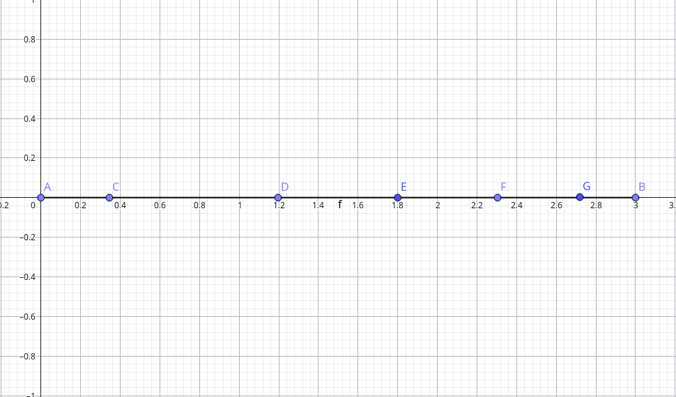

# Integração 

# Introdução 

--- 

Quando estudamos o estudo das **integrais** em uma única variável, estamos normalmente nos referindo a um tipo específico de integral, chamada **Integral de Riemann**, nomeada em homenagem ao matemático alemão Bernhard Riemann. 

Embora o conceito de uma função que nos fornecesse a área sob o gráfico de uma determinada função já existisse desde Newton e Leibnitz, o matemático ao lado foi o primeiro a fornecer uma definição verdadeiramente rigorosa para essa função, a partir de conceitos prévios na matemática, como **limites** e **partições** de conjuntos.

<i>Riemann mostrando que ser matemático não implica em postura ruim. Domínio público, via <a href="https://commons.wikimedia.org/wiki/File:Bernhard_Riemann_3.jpg" target="_blank">Wikimedia Commons</a>.</i>

Riemann também é famoso por outras contribuções igualmente monumentais nos campos da análise real, análise complexa. geometria não-euclideana e muitos outros, pavimentando inclusive a matemática necessária para descrever a Relatividade Geral de Einstein. Ele também era bastante tímido e ficava doente com facilidade.

Dessa forma, para compreendermos a definição exposta por Riemann para esse importante objeto matemático, precisamos ter em mente alguns conceitos fundamentais, a saber, a **partição de um intervalo** e a **soma de Riemann**.

## Partição de um intervalo

---

Definimos a partição de um intervalo da seguinte maneira: 

<aside>

<i>Dado um intervalo fechado $I=[a,b]$</i>, chamamos <b>partição de $I$</b> o conjunto de $n+1$ pontos no intervalo $I$ de forma que o valor de cada um seja estritamente maior que o outro. Os valores extremos dessse conjunto $P$ são os extremos do intervalo. 

</aside>

<i>Um exemplo de partição do intervalo $[0,3].$</i>

A partição de um intervalo o subdivide em $n$ subintervalos, com o tamanho do maior intervalo sendo chamado <b>norma da partição</b> $P$. Em termos mais restritos, podemos definir essa norma pela expressão

$$
|P| = \max{(t_i - t_{i-1})}
$$

Com $i$ referindo-se a cada ponto na partição. No exemplo acima, a norma da partição seria a distância entre os pontos $\text{C}$ e $\text{D}$, ou seja, o tamanho do intervalo formado por esses pontos. 

## Soma de Riemann

---

A soma de Riemann é uma das maneiras de construir a <b>integral de Riemann</b>, talvez a mais conhecida. Definimos-a da seguinte maneira: 

<aside>

<i>Dados $f: [a,b] \rightarrow \mathbb{R}$ limitada e contínua; $P$ uma partição de $[a,b]$ e números $c_i \in [a,b]$ de forma que $t_{i - 1} < c_i < t_i$ — isto é, cada número $c_i$ pertencendo ao respectivo subintervalo de mesmo índice — definimos a <b>soma de Riemann referente à partição $P$ e à escolha dos $c_i$</b> por

$$
S(f, P, \{c_i\}^n_{i=1}) = \sum_{i=1}^nf(c_i) \cdot \Delta t_i
$$

onde $\Delta t_i = t_i - t_{i-1}$</i>
</aside>

<i>Exemplo visual do que está acontecendo ao definirmos uma soma de Riemann para uma determinada partição do domínio de uma função. Estamos calculando a área de diversos retângulos e aproximando a área sob o gráfico. GIF sob CC-BY-SA, via <a href="https://commons.wikimedia.org/wiki/File:Riemann_sum_(leftbox).gif" target="_blank">Wikimedia Commons</a>.</i>

# Definindo integrais (de Riemann)

---

Por fim, chegamos à definição de integral chegada por **Bernhard Riemann**, que se utiliza dos conceitos expostos anteriormente, a **soma de Riemann** e a **partição** de um conjunto. Ela é definida da seguinte forma:

<aside>

<i>Seja $f: [a,b] \rightarrow \mathbb{R}$. Dizemos que $f$ é integrável se existe $L \in \mathbb{R}$ tal que $L = \lim_{|P| \rightarrow 0} S(f, P, \{c_i\})$ para toda escolha possível dos $c_i$ numa partição $P$.</i>

</aside>

Ou seja, de forma mais palatável, uma função é **integrável** se, ao analisarmos todas as partições possíveis de seu domínio com normas cada vez menores (mais subintervalos), as somas de Riemann consideradas se aproximam do mesmo número, a mesma área sob o gráfico.

Por fim, escrevemos esse limite por uma notação resumida,

$$
L = \int_{a}^{b} f(x) \text{ dx}
$$

para nos referir à área $L$ sob o gráfico da função $f(x)$ entre os valores $a$ e $b$ do domínio. 

## Propriedades da integral

---

Dada essa definição inicial da integral, podemos encontrar algumas de suas propriedades, decorrentes do fato de que elas são, na verdade, limites. 

Assim, dadas funções $f,g:[a,b] \rightarrow \R$  integráveis, temos que:

$$
\begin{align*}
    \int_a^bf(x)+g(x) \text{ dx} &= \int_a^b f(x) \text{ dx} + \int_a^b g(x) \text{ dx} \\\\\\\\
    \int_a^b kf(x) \text{ dx} &= k \int_a^b f(x) \text{ dx}, k \in \R \\\\\\\\ 
    f(x) \ge 0, \forall x \in [a,b] &\Rightarrow \int_a^b f(x) \text{ dx} \ge 0 \\\\\\\\ 
    c \in [a,b] &\Rightarrow \int_a^c f(x) \text{ dx} + \int_c^b f(x) \text{ dx}
\end{align*}
$$

Além disso, temos que toda função **contínua** é **integrável**, embora algumas funções descontínuas preservem a propriedade de integração. Encontrar todas as condições que tornam uma função integrável está fora do escopo deste documento.

# Calculando integrais

---

Até aqui, conseguimos definir integrais, operações que nos fornecem a área sob o gráfico de uma determinada função, mas não temos ainda um método eficiente de calculá-las: seguir a definição de Riemann seria um trabalho descomunalmente intensivo. 

Dessa forma, vamos introduzir alguns conceitos, a saber os conceitos de **primitivas** e por fim o **Teorema Fundamental do Cálculo**, que irão nos ajudar a calcular integrais de maneiras um pouco mais rápidas. 

## Primitivas

---

Definimos **primitivas**, também conhecidas como **antiderivadas**, da seguinte maneira:

<aside>

<i>

Seja $f: \mathbb{R} \rightarrow \mathbb{R}$ uma função. Uma <b>primitiva</b> de $f$ é uma função $F: \mathbb{R} \rightarrow \mathbb{R}$ derivável tal que $F'(X) = f(x)$.

</i>

</aside>

Uma consequência imediata dessa definição é a constatação de que **se uma função $f$ possui uma primitiva**, ela possui **infinitas**. Demonstrando essa afirmação:

<aside>

<i>Se $F(x)$ e $G(x)$ são primitivas de uma função $f(x)$, então:</i>

$$
\begin{align*}
    F'(x) &= G'(x) \\\\\\\\ 
    F'(x)-G'(x) &= 0 \\\\\\\\ 
    (F-G)'(x) &= 0
\end{align*}

$$

<i>Perceba que, pelo <a href="/books/higher_education/math/calculus_one/derivatives_applications.html">teorema do valor médio</a>, $F(x)$ e $G(x)$ diferem apenas por uma constante real, logo:</i>

$$
F(x) = G(x) + k, k \in \mathbb{R}
$$

</aside>

Disso decorre a existência de infinitas primitivas para uma mesma função, diferindo entre si por apenas uma constante real. Dessa forma, podemos denotar o conjunto de <b>todas as possíveis primitivas de $f$</b> por meio da notação a seguir. 

$$
\int f(x) \text{ dx}
$$

Por fim, é importante ter em mente outro teorema importante, demonstrado no apêndice, cuja conclusão é que <b>toda função contínua possuí primitiva</b>.

## Técnicas de integração

---

As **primitivas** — e as integrais de forma geral — possuem propriedades úteis que facilitam o seu cálculo, que por sua vez irá colaborar no cálculo de integrais, consequência exposta na próxima seção. 

### Mudança de variável

---

A propriedade da mudança de variável nos permite mudar a variável da função que está sendo integrada, permitindo uma maior facilidade. A ideia por trás dessa propriedade é uma espécie de “desfazimento” da regra da cadeia.

A seguir, usamos a definição exposta por Guidorizzi:

<aside>

<i>Seja $f$ contínua num intervalo $I$ e sejam $a$ e $b$ dois números reais quaisquer em $I$. Seja $g: [c,d] \rightarrow I$, com $g'$ contínua em $[c,d]$, tal que $g(c) = a$ e $g(d) = b$. Nestas condições:</i>

$$
\int_{a}^{b} f(x) \text{ dx} = \int_{c}^{d} f(g(u)) \cdot g'(u) \text{ du}
$$

</aside>

Por exemplo, na integração $\int_{2}^{3} (x-2)^8 \text{ dx}$, podemos substituir $u = x-2$ e, consequentemente, $du = dx$. Os limites de integração mudarão de acordo com a nova variável, com $x = 2 \rightarrow u = 0, x = 3 \rightarrow u = 1$. 

Por fim, a integral se torna $\int_{0}^{1} u^8 \text{ du}$, tremendamente simplificando sua avaliação: 

$$ 
\int_{0}^{1} u^8 \text{ du} = \left[\dfrac{u^9}{9}\right]_{0}^{1} = \dfrac{1^9}{9} - \dfrac{0^9}{9} = \dfrac{1}{9}
$$

<aside>

<i>Perceba que a derivada entre os colchetes com os limites de integração é uma notação condensada para a subtração entre as antiderivadas; lemos <b>avaliada entre</b> $x$ e $y$, com estes dois números sendo os limites de integração.</i>

</aside>

Por fim, qual o motivo da origem de $du = dx$, e como essa substituição funciona? 

Nesse exemplo, definimos $u = g(x) = x-2$. Pela diferenciação, temos que $\dfrac{du}{dx} = \dfrac{d}{dx}(x-2) = 1 \rightarrow du = dx$. Curiosamente, isso <b>não funcionaria</b>, já que notações de derivadas são apenas notações, não "frações" de fato. Entretanto, isso pode ser provado de forma rigorosa, também. 

### Integração por partes

---

A **integração por partes** é uma maneira de “reverter” a regra do produto. 

De fato, podemos provar a propriedade: 

$$
\int f'(x) g(x) \text{ dx} = f(x)g(x) - \int f(x) g'(x) \text{ dx}
$$

A demonstração é bem direta. Basta apenas encontrar a primitiva de $(fg)'$ e rearranjar os termos.

Um bom e simples exemplo para essa regra é a integral $\int x \cos{x} \text{ dx}$. Por meio da integração por partes, podemos definir $f(x)=x$ e $g'(x) = \cos{x}$. Aplicando a regra: 

$$
\int x \cos{x} \text{ dx} = x \sin{x} - \int 1 \cdot \sin{x} = x \sin{x} + \cos{x} + k
$$

Com $k$ sendo a constante de integração, qualquer número real. 

### Integração por frações parciais

---

Podemos nos utilizar deste método quando precisamos integrar uma função racional $R(x)=\dfrac{P(x)}{Q(x)}$. A ideia é reescrever essa função como uma soma de frações mais simples cujos denominadores são fatores linear ou quadráticos do polinômio denominador.

Esse método possui duas restrições para sua utilização:

- $\text{grau}(P) \lt \text{grau}(Q)$, caso contrário, é recomendado executar a divisão de polinômios primeiro
- É possível fatorar $Q(x)$ em termos lineares ou quadráticos

Como podemos aplicá-lo? Primeiro fatoramos $Q(x)$, depois disso, montamos a igualdade

$$
\dfrac{P(x)}{Q(x)}=\sum_i \dfrac{A_i}{x - r_i} + \sum_j \dfrac{B_jx + C_j}{(x^2+px+q)_j}
$$

com $A_i$, $B_j$ e $C_j$ constantes que ainda não sabemos o valor, $r_i$ as raízes e os denominadores termos lineares ou quadráticos da fatoração de $Q(x)$. Depois, aplicamos a integral em cada termo de forma separada. 

Por exemplo, como integrar a seguinte função racional? 

$$
\int \dfrac{2x+3}{x^2+x-2} \text{ dx}
$$

Primeiro, fatoramos o polinômio denominador: 

$$
x^2+x-2=(x+2)(x-1)
$$

E reescrevemos a expressão: 

$$
\dfrac{2x+3}{x^2+x-2} = \dfrac{A}{x-1} + \dfrac{B}{x+2}
$$

Multiplicando ambos os lados por $x^2 + x - 2$: 

$$
2x+3=A(x+2)+B(x-1)
$$

Resolvendo para $A$ e $B$, chegamos em $A=\dfrac{5}{3}$ e $B=\dfrac{1}{3}$. 

Substituindo na integral original, podemos resolvê-la: 

$$
\begin{align*}
\int \dfrac{2x+3}{x^2+x-2} &= \int \dfrac{5}{3} \cdot \dfrac{1}{x-1} \text{ dx}\, +\int \dfrac{1}{3} \cdot \dfrac{1}{x+2} \\\\ 
&= \dfrac{5}{3} \int \dfrac{1}{x-1} \text{ dx} \, + \dfrac{1}{3} \int \dfrac{1}{x+2} \\\\ 
&= \dfrac{5}{3} \ln |x-1| + \dfrac{1}{3} \ln |x+2| + k
\end{align*}
$$

# Sólidos de revolução: volumes, áreas e comprimentos

---

Chamamos de **sólido de revolução** o sólido gerado pela rotação do gráfico de uma função em torno de um eixo (linha reta). Embora essa rotação seja possível para qualquer eixo, neste documento iremos tratar apenas dos eixos horizontais e verticais, em especial os cartesianos $(x=0; y=0)$.

## Revolução em torno do eixo horizontal

---

Podemos calcular o **volume desse sólido** por meio de uma adaptação da expressão usual para uma integral, consequência da modificação da soma de Riemann para esse novo cenário: ao invés de somarmos infinitos retângulos, iremos somar infinitos **cilindros**, formados pela rotação desses “retangulinhos”.

Dessa forma, a integral $\int_a^b f(x) \text{ dx}$  se transforma em $\pi \int_a^b \cdot [f(x)]^2 \text{ dx}$. Essa é a expressão necessária para o cálculo do **volume** de qualquer sólido de revolução com rotação em torno do eixo x.

<aside>

Essa noção pode ser adaptada como a integral da área da seção transversal ao longo do intervalo do sólido, se a dimensão dessas áreas dependerem apenas de uma só variável — $\int_a^b A(x) \text{ dx}$. Essa noção é útil para qualquer integral de volume.

</aside>

Se considerarmos outros eixos horizontais que não sejam o eixo das abscissas, podemos adaptar nossa integral para: 

$$
\pi \int_a^b [f(x)-y_R]^2 \text{ dx}
$$

Com $y_R$ sendo a constante da reta horizontal, o eixo de rotação.

## Revolução em torno do eixo vertical

---

Agora, se a função estiver sendo rotacionada entorno do eixo y, para calcular o volume desse sólido teremos que nos valer da chamada <i>shell integration</i> (”integração em concha”).

<i>Ilustração da integração em concha. Note a revolução do gráfico em torno do eixo vertical, enquanto a integral calculada tem sua variável de integração no eixo perpendicular. Imagem por Blacklemon67, via <a href="https://commons.wikimedia.org/wiki/File:Shell_integral_undergraph_-_around_y-axis.png">Wikimedia Commons</a>.</i>

De forma mais geral, é um método utilizado para o cálculo do volume de um sólido de revolução quando os limites de integração estão no eixo **perpendicular** ao eixo de revolução.

Considerando uma integração no intervalo $[a,b]$ e $r(x)=x-x_R$, com $x_R$ a constante da reta vertical — o eixo de rotação — podemos escrever: 

$$
V_y = 2 \pi \int_a^b r(x)f(x) \text{ dx}
$$

É importante mencionar que quando $r(x) = x$, temos o caso da revolução em torno do eixo $y$ do espaço cartesiano. 

Perceba que um sólido de revolução possui uma superfície externa, uma **“casca”**, além da própria curva da função $f(x)$. Perguntas naturais a se fazer a partir desse fato são: é possível calcular a área dessas superfícies? É possível calcular o comprimento dessas linhas? A resposta, claro, é sim. 

# Apêndice A: Teorema do Valor Médio para Integrais

---

Podemos adaptar o **teorema do valor médio (TVM)**, originalmente definido para a operação de derivação, para a integração.

<aside>

<i>

Sejam $\phi, f: [a,b] \rightarrow \mathbb{R}$ contínuas com $\phi \ge 0, \forall x \in [a, b]$. Então existe $c \in [a,b]$ tal que $\int_{a}^{b} f(x) \phi(x) \text{ dx} = f(c) \cdot \int_{a}^{b} \phi(x) \text{ dx}$.

</i>

</aside>

Uma interessante interpretação geométrica é possível quando $\phi(x) = 1$. 

$$ 
\phi(x) = 1 \Rightarrow \int_{a}^{b} f(x) \text{ dx} = f(c)(b-a)
$$

Calcular essa última expressão é o equivalente de encontrar a área do retângulo com base no tamanho dos limites de integração e da altura $f(c)$, além de demonstrarmos que a área desse retângulo possui a mesma área que a integral da função. 

## Demonstração 

---

Podemos demonstrar esse teorema da seguinte maneira: 

<aside>

<i>

O teorema de Weierstrass (também conhecido pela alcunha <b>teorema dos valores extremos</b>) expõe que $\exists m, M \in \mathbb{R}$ tais que $m \le f(x) \le M, \forall x \in [a,b]$. Como $\phi \ge 0, \forall x in [a,b]$, temos que: 

</i>

</aside>

$$
\begin{align*}
  &\Rightarrow m \cdot \phi(x) \le f(x) \cdot \phi(x) \le M \cdot \phi(x) \\\\
  &\Rightarrow \int_a^b m \cdot \phi(x) \text{ dx} \le \int_a^b f(x) \cdot \phi (x) \text{ dx} \le \int_a^b M \cdot \phi(x) \text{ dx} \\\\ 
  &\Rightarrow m \int_a^b \phi(x) \text{ dx} \le \int_a^b f(x) \cdot \phi(x) \text{ dx} \le M \cdot \int_a^b \phi (x) \text{ dx}
\end{align*}
$$

Substituindo $int_{a}^{b} \phi(x) \text{ dx} = I$ por brevidade, encontramos: 

$$ 
\begin{align*}
m \cdot I \le \int_a^b f(x) \cdot \phi(x) \text{ dx} \le M \cdot I \\\\
m \le \dfrac{\int_a^b f(x) \cdot \phi(x) \text{ dx}}{I} \le M
\end{align*}
$$

Por fim, pelo teorema do valor intermediário regular, concluímos que $\exists c \in [a,b]$ tal que $f(c) = \dfrac{\int_{a}^{b}f(x) \cdot \phi(x) \text{ dx}}{I}$, logo, $\int_{a}^{b} f(x) \cdot \phi(x) \text{ dx} = f(c) \cdot \int_{a}^{b} \phi(x) \text{ dx}$, que era o que queríamos demonstrar. 

## Exemplo de utilização

---

Esta adaptação do TVM é útil na demonstração feita anteriormente, de que toda função contínua possui primitiva(s). 

Seja $f: \mathbb{R} \rightarrow \mathbb{R}$ contínua. Tome $F(x) = \int_{a}^{x} f(t) \text{ dt}$ e $a \in D_f$. 

$$
\begin{align}
  F'(x)&=\lim_{h \rightarrow 0} \dfrac{F(x+h)-F(x)}{h} \\\\ 
  &= \lim_{h \rightarrow 0}\dfrac{\int  _a^{x+h} f(t) \text{ dt} - \int_{a}^x f(t) \text{ dt}}{h} \\\\ 
  &= \lim_{h \rightarrow 0} \dfrac{\int_x^{x+h} f(t) \text{ dt}}{h}
\end{align}
$$

Por meio do teorema do valor médio para integrais, podemos reescrever $\int_{x}^{x+h} f(t) \text{ dt} = f(c) \cdot h$, com $c \in [x, x+h]$. 

$$
\lim_{h \rightarrow 0} \dfrac{f(c) \cdot h}{h}=\lim_{h \rightarrow 0} f(c) = f(x)
$$

Podemos afirmar essa última igualdade em razão da afirmação que $f$ é uma função contínua. Quando $h \rightarrow 0$, o intervalo se estreita e colocamos $c $ arbitrariamente próximo de $x$. Como $f$ é contínua, $\lim_{c \rightarrow x} f(c)=f(x)$.
Dessa forma, $F'(x)=f(x)$, que era o que queríamos demonstrar.

# Apêndice B: Primitivas de potências de trigonométricas

---

É possível encontrar algumas propriedades que facilitam o cálculo das primitivas de produtos de funções trigonométricas e em especial suas potências, inclusive por **fórmulas de recorrência**. 

O primeiro caso notável é o da integral $\int \sin^n{x} \cdot \cos^m{x} \text{ dx}$.

Caso $n$ seja ímpar, um atalho rápido é substituir $u = \cos{x}$. Caso $m$ seja ímpar, um outro atalho é substituir $u=\sin{x}$. Se ambos forem pares, a decisão mais prática é rescrever 

$$
\begin{align*} 
\sin^2{x} &= \dfrac{1 - \cos{2x}}{2} \\\\\\\\ 
\cos^2{x} &= \dfrac{1 - \cos{2x}}{2}
\end{align*}
$$

Além disso, temos o caso da integral $\int \sec^n{x} \tg^m{x} \text{ dx}$, que pode ser da maneira:

$$
\int \sec^n{x} \tg^m{x} \text{ dx} = \begin{cases}
\int \sec^{n-1}{x} \cdot (\sec^2{x} - 1)^{\dfrac{m-1}{2}} \sec{x} \tan{x} \text{ dx} & m\text{ ímpar} \\\\ 
\int \sec^n{x} \cdot (\sec^2{x} - 1)^\dfrac{m}{2} \text{ dx} & m \text{ par}
\end{cases}
$$

No primeiro caso de paridade, ainda é útil a substituição $u=\sec{x}$. 

## Fórmulas de recorrência

---

Abaixo estão listadas algumas expressões de recorrência para o cálculo das primitivas das potências de diversas funções trigonométricas. 

$$
\begin{align*}
\int \sin^n{x} \text{ dx} &= -\dfrac{1}{n} \sin^{n-1} x \cos x + \dfrac{n-1}{n} \int \sin^{n-2}{x} \text{ dx} \\\\ 
\\\\
\int \cos^n{x} \text{ dx} &= \dfrac{1}{n} \cos^{n-1}{x} \sin{x} + \dfrac{n-1}{n} \int \cos^{n-2}{x} \text{ dx} \\\\ 
\\\\
\int \tg^n{x} \text{ dx} &= \dfrac{\tg^{n-1}{x}}{n-1} - \int \tg^{n-2}{x} \text{ dx} \\\\ 
\\\\
\int \sec^n{x} \text{ dx} &= \dfrac{\sec^{n-2}{x}  \tg{x}}{n-1} + \dfrac{n-2}{n-1} \int \sec^{n-2}{x} \text{ dx} \\\\
\end{align*}
$$