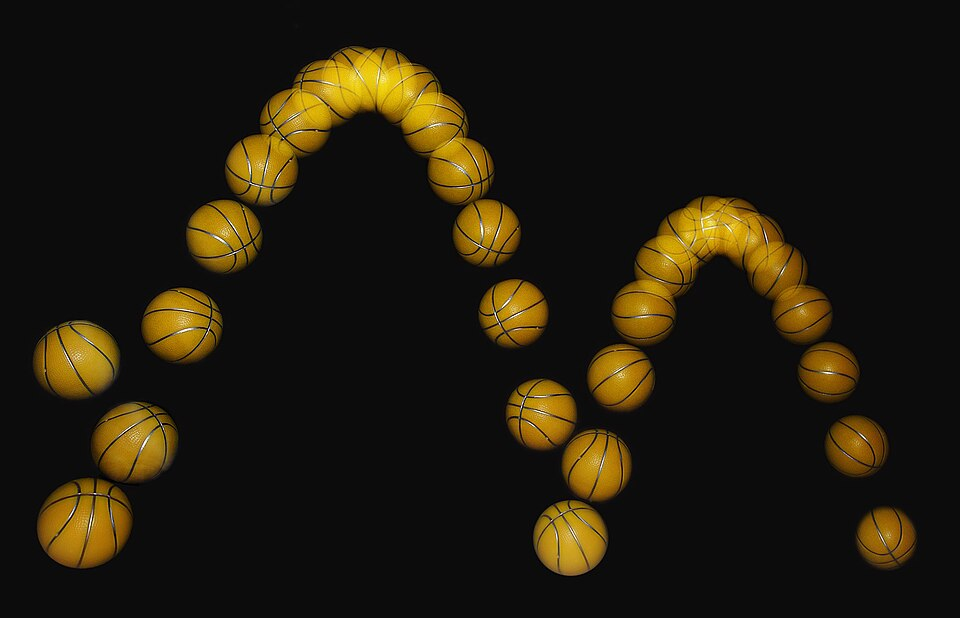
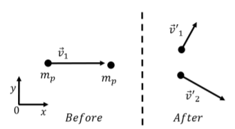

# Momento linear e colisões

# Momento 

---

Chamamos **momento** $(\overrightarrow{p})$ a grandeza associada ao movimento de um corpo, dependente de sua massa e velocidade. Originalmente, ao definí-la, Newton a chamou de "quantidade de movimento". 

Chamada **momento linear** quando considerada em apenas uma única dimensão, como escalar, a grandeza do momento pode ser compreendida como a "inércia" da mudança de movimento de um corpo. Essa "dificuldade" é classicamente ilustrada pelo exemplo do automóvel e do carrinho de bebê — é infinitamente mais fácil parar um carrinho de bebê com as mãos do que o automóvel. 

# Impulso

---

O **impulso** $(\overrightarrow{I})$ é a grandeza oriunda duma força e de seu tempo de atuação sobre um corpo. O impulso de uma força mede a variação do momento deste corpo sob a atuação daquela força, com esta conclusão sendo chamada **Teorema Impulso-Momento** ou, simplesmente, **Teorema do Impulso**. 

$$ 
I = \int_{t_1}^{t_2} F(t) \text{ dt} = \Delta p
$$

# A Terceira Lei de Newton e a Conservação do Momento

---

A **Terceira Lei de Newton**, comumente conhecida pela denominação **Lei da Ação e Reação**, também pode ser chamada pela alcunha de **Lei da Conservação do Momento** por razões já previamente demonstradas <a href="/books/higher_education/physics/physics_one/newtons_laws.html">aqui</a>. 

Entretanto, é importante deixar claro que a conclusão enunciada pela Lei vale apenas para **sistemas fechados**, isto é, sistemas físicos sem interação com forças externas ao sistema estudado. De fato, além dessa condição, é necessário que a massa permaneça constante ao longo do tempo. 

Podemos também escrever que, dado um sistema fechado com $n$ partículas, a soma de todos os seus momentos é constante, ou seja: 

$$
\sum_{j = 1}^N p_j = k, k \in \mathbb{R}
$$

Por fim, talvez seja necessário um pequeno lembrete:

<aside>
Chamamos <i>sistema físico</i> a coleção de corpos que estão sob o nosso interesse. Por exemplo, ao estudarmos a colisão de dois carros, o nosso sistema é composto pelos dois carros. 
</aside>

## Colisões

---

Podemos classificar as colisões entre corpos em **perfeitamente elásticas**, **perfeitamente inelásticas** ou ainda, simplesmente, **inelásticas**. 

Nas colisões inelásticas, as mais comuns, temos a dissipação de energia cinética no sistema ao compararmos o antes e o depois das colisões. Um exemplo desta categoria seria o quicar deu uma bola no chão sucessivas vezes. É visível que a cada quicar, a bola sobe cada vez menos. 

<i>Fotografia estroboscópica de uma bola de basquete quicando no chão. Perceba que as alturas máximas ficam cada vez menores. CC-BY-SA via <a href="https://commons.wikimedia.org/wiki/File:Bouncing_ball_strobe_edit.jpg">Wikimedia Commons</a></i>.

Nas colisões perfeitamente elásticas, além da conservação do momento, temos a conservação perfeita da energia cinética. Nas colisões perfeitamente inelásticas, o máximo possível de energia cinética é perdido, preservando a conservação do momento. 

### Em mais de uma dimensão

---

As colisões também podem ser analizadas em mais de uma dimensão. Um caso interessante para começar esta observação seria de uma colisão perfeitamente elástica. De cara, é perceptível a utilidade de traçar um vetor $r_{12}$ entre os dois corpos, e analisar suas trajetórias pós-colisão em termos de <b>ângulos de espalhamento</b>. 

<i>Diagrama de colisão bidimensional. Perceba que os vetores de velocidade (e portanto, de momento) dos dois corpos fazem um ângulo relativo ao eixo horizontal. Esses ângulos são os ângulos de espalhamento.</i>

<aside>

Uma outra informação de utilidade é que mudar o referencial do problema de forma que uma das partículas esteja em repouso pode grandemente simplificar o problema. 

</aside>

No caso perfeitamente elástico — com conservação total tanto do momento como da energia cinética — é possível escrever as seguintes expressões: 

$$ 
\begin{align*}
    \vec{p_{1i}} &= \vec{p_{1f}} + \vec{p_{2f}} \\\\
    \dfrac{p_{1i}^2}{2m_1} &= \dfrac{p_{1f}^2}{2m_1} + \dfrac{p_{2f}^2}{2m_2}
\end{align*}
$$

Reorganizando a segunda equação, concluímos que

$$
p_{2f}^2 = \dfrac{m_2}{m_1}(p_{1i}^2 - p_{1f}^2)
$$

e, a partir da primeira, é possível escrever:

$$
\vec{p_{2f}} = \vec{p_{1i}} - \vec{p_{1f}}
$$

A partir desta equação , sem recorrer à trigonometria, é possível calcular o quadrado do momento final da partícula 2 (a que sofreu a colisão): 

$$
\begin{align*}
    p_{2f}^2 &= (\vec{p_{1i}} - \vec{p_{1f}}) \cdot (\vec{p_{1i}} - \vec{p_{1f}}) \\\\
    &= p_{1i}^2 + p_{1f}^2 - 2 \vec{p_{1i}} \cdot \vec{p_{1f}} \\\\
    &= p_{1i}^2 + p_{1f}^2 - 2 p_{1i}p_{1f} \cdot \cos{\theta_1}
\end{align*}
$$

Onde $\theta_1$ é o ângulo de espalhamento do corpo 1 (que colidiu com o corpo inicialmente em repouso). 

Igualando a expressão anterior com a produzida pela reorganização da equação de conservação da energia cinética, além de definir $\lambda = \dfrac{m_2}{m_1}$, escrevemos: 

$$
\lambda p_{1i}^2 - \lambda p_{1f}^2 = p_{1i}^2 + p_{1f}^2 - 2p_{1i}p_{1f} \cdot \cos{\theta_1}
$$

Reorganizando os termos, obtemos uma equação do segundo grau cuja incógnita é $p_{1f}$: 

$$
(1 + \lambda) p_{1f}^2 - (2p_{1i} \cos{\theta_1}) p_{1f} + (1-\lambda)p_{1i}^2 = 0 
$$

Portanto, 

$$
p_{1f} = \left(\dfrac{p_{1i}}{1 + \lambda}\right)(\cos{\theta_1} \pm \sqrt{\cos^2{\theta_1} + \lambda^2 - 1})
$$

A partir de $\lambda$, é possível explorar os possíveis cenários de colisão entre os corpos. 
Por exemplo, quando $m_1 \gt m_2 \Rightarrow \lambda \lt 1$, podemos perceber que, como o momento deve ser um número real, $\cos{\theta_1}^2 - 1 + \lambda^2 \ge 0$.

Logo, $\cos{\theta_1}^2 - 1 + \lambda^2 \iff -\sin{\theta_1}^2 + \lambda^2 \ge 0$ e $\sin{\theta_1} \le \lambda = \sin{\theta_{\text{max}}}$. Ou seja, caso a partícula que esteja efetuando a colisão tenha uma massa maior que a partícula "alvo", seu ângulo de deflexão é limitado dentro de um intervalo. 

E no caso contrário? Se a massa do corpo alvo for maior que a massa do corpo de colisão, $\lambda \gt 1$ e portanto qualquer $\theta_1$ resulta num valor válido para o momento do corpo 1. Em outras palavras, se a partícula incidente for mais leve, qualquer ângulo de deflexão é possível. 

O que podemos explorar sobre colisões inelásticas? Um exemplo bem interessante pode ser encarar o problema de tentar formar uma reação em cadeia em átomos de $\text{U}_{235}$ a partir da colisão de um nêutron com um único átomo. 
Qual é o problema aqui? Um nêutron precisa estar em baixa velocidade para poder ser capturado pelo núcleo do átomo, possuindo uma energia de $\approx 1 \text{ eV}$, entretanto, os nêutrons liberados por um núcleo fissionados estão em velocidade (e energia) ordens de magnitude maior, por volta de $\approx 1 \text{ MeV}$.

Uma maneira de reduzir a velocidade dessas partículas é efetuar colisões de forma que a energia cinética seja dissipada: o melhor material para isso encontrado até o momento é o grafite, $\text{C}_{12}$. Melhor não em sentido de eficácia, pois após uma única colisão o nêutron continua com muita velocidade, porém o carbono é abundante na natureza, talvez um dos mais abundantes.

Esta é a origem de grafite num reator nuclear: sua presença no reator desacelera os nêutrons e estimula uma reação em cadeia, com o calor gerado sendo utilizado para ferver a água no interior, produzindo vapor que será utilizado para rotacionar uma turbina.

As hastes de <b>controle</b>, por sua vez, geralmente feitas de boro ou outro elemento, como háfnio, funcionam pois estes elementos são excelentes capturadores de nêutrons, conseguindo absorvê-los mesmo em altas energias, diminuindo a quantidade de elétrons no núcleo do reator e permitindo que a reação em cadeia decaia exponencialmente. 

<i>Acima: diagrama ilustrando um reator nuclear com hastes de controle de boro e grafite como "moderador" dos nêutrons. Domínio público, via <a href="https://commons.wikimedia.org/wiki/File:Nuclear_Reactor_Uranium_Pile_(30502443888).jpg">Wikimedia Commons</a>.</i>

É possível deduzir as expressões para as colisões **perfeitamente elásticas** e **perfeitamente inelásticas** por meio de nossos conhecimentos de mecânica e álgebra linear. Vamos iniciar com o caso perfeitamente elástico.
Considerando dois corpos com seus centros ligados por um vetor $\Delta \bold{x}$, podemos escrever os impulsos $\vec{J_1}$ e $\vec{J_2}$ sofridos pelos corpos e outras informações nas seguintes equações: 

$$
\begin{align*}
    \vec{J_1} &= p_1' - p_1 \\\\
    \vec{J_2} &= p_2' \\\\
    \vec{J_1} &= -\vec{J_2} \\\\
    \vec{J} &\equiv \vec{J_1} = -\vec{J_2} = \lambda \vec{\hat{n}}, \lambda \in \mathbb{R} \\\\
    \vec{\hat{n}} &= \dfrac{\Delta \bold{x}}{||\Delta\bold{x}||}
\end{align*}
$$

A partir do exposto acima, vale notar que estamos considerando um referencial que mantém o corpo 2 inicialmente em repouso. Uma outra informação importante é a relação entre os vetores de impulso, iguais em módulo e opostos em sentido, no momento da colisão. Suas magnitudes são dadas a partir do produto entre um certo $\lambda$ real e um vetor unitário colinear $\vec{\hat{n}}$ a distância entre os centros dos corpos. 

Dessa forma, é possível escrever as seguintes equações para as velocidades pós-colisão, considerando como constante a massa dos corpos: 

$$
\begin{align*}
    \vec{v_1'} &= v_1 + \dfrac{\lambda}{m_1}\vec{\hat{n}} \\\\
    \vec{v_2'} &= - \dfrac{\lambda}{m_2}\vec{\hat{n}}
\end{align*}
$$

A partir da equação da conservação da energia cinética — dado que estamos tratando do caso perfeitamente elástico — é possível escrever: 

$$ 
\dfrac{1}{2}m_1||\vec{v_1}||^2 = \dfrac{1}{2}m_1||\vec{v_1'}||^2 + \dfrac{1}{2}m_2||\vec{v_2'}||^2
$$

Substituindo as equações de velocidade na relação de energia cinética acima e simplificando: 

$$
\begin{align*}
    \dfrac{1}{2}m_1||\vec{v_1}||^2 &= \dfrac{1}{2}m_1 \left|\left| \vec{v_1} + \dfrac{\lambda}{m_1} \vec{\hat{n}}\right|\right|^2 + \dfrac{1}{2}m_2 \left|\left|-\dfrac{\lambda}{m_2}\vec{\hat{n}}\right|\right|^2 \\\\
    &= \dfrac{1}{2}m_1 \left(||\vec{v_1}||^2 + \left\langle \dfrac{\lambda}{m_1}\vec{\hat{n}}, \dfrac{\lambda}{m_1}\vec{\hat{n}} \right\rangle + 2 \left\langle \vec{v_1}, \dfrac{\lambda}{m_1} \vec{\hat{n}} \right\rangle\right) + \dfrac{1}{2}m_2 \left\langle -\dfrac{\lambda}{m_2}\vec{\hat{n}}, -\dfrac{\lambda}{m_2}\vec{\hat{n}} \right\rangle \\\\
    &= \dfrac{1}{2}m_1 \left(||\vec{v_1}||^2 + \left(\dfrac{\lambda}{m_1}\right)^2 + 2\left(\dfrac{\lambda}{m_1}\right)\langle \vec{v_1}, \vec{\hat{n}}\rangle\right) + \dfrac{1}{2}m_2 \left(\dfrac{\lambda}{m_2}\right)^2 \\\\
\end{align*}
$$

$$
\begin{align*}
    \dfrac{1}{2}m_1 \left(\dfrac{\lambda}{m_1}\right)^2 + \dfrac{1}{2}m_1 \cdot 2 \left(\dfrac{\lambda}{m_1}\right) \langle \vec{v_1}, \vec{\hat{n}}\rangle  + \dfrac{1}{2}m_2\left(\dfrac{\lambda}{m_2}\right)^2 &= 0 \\\\
    \dfrac{\lambda^2}{2m_1} + \dfrac{\lambda^2}{2m_2} + \lambda \langle \vec{v_1}, \vec{\hat{n}} \rangle &= 0 \\\\
    \lambda^2 \dfrac{m_1 + m_2}{m_1m_2} + 2\lambda \langle \vec{v_1}, \vec{\hat{n}} \rangle &= 0
\end{align*}
$$

Fatorando $\lambda$ da equação, encontramos $\lambda_1=0$, a solução trivial, que representa fisicamente a ausência de colisão entre os corpos, e $\lambda_2 = -\dfrac{2m_1m_2 \langle \vec{v_1}, \vec{\hat{n}}\rangle}{m_1 + m_2}$.

Substituindo $\lambda_2$ nas equações vetoriais de velocidade pós-colisão e simplificando, encontramos suas formas finais: 

$$ 
\begin{align*}
    \vec{v_1'} = \vec{v_1} - \dfrac{2m_2 \langle \vec{\hat{n}}, \vec{v_1} \rangle}{m_1 + m_2} \vec{\hat{n}} \\\\
    \vec{v_2'} = \dfrac{2m_1 \langle \vec{\hat{n}}, \vec{v_1} \rangle}{m_1 + m_2}\vec{\hat{n}}
\end{align*}
$$

Partindo para o caso perfeitamente inelástico, podemos utilizar a mesma configuração exposta anteriormente, além de uma 
adaptação da dedução previamente realizada no <a href="books/high_school/physics/physics1/momentum.html">livro correspondente do ensino médio</a>. 

Adaptando a equação de conservação do momento $P$, produzimos duas equações:

$$
\begin{align*}
    ||v_1'|| = \dfrac{m||v_1|| + m||v_2|| - m_2||v_2'||}{m_1} = \dfrac{P - m_2||v_2'||}{m_1} \\\\ 
    ||v_2'|| = \dfrac{m||v_1|| + m||v_2|| - m_2||v_2'||}{m_1} = \dfrac{P - m_1||v_1'||}{m_2}
\end{align*}
$$

Escrevendo a energia cinética após a colisão como $K_F$ e substituindo a expressão para $||v_1'||$ acima, podemos simplificar, produzindo: 

$$
\begin{align*}
    K_F &= \dfrac{1}{2}m_1 \left(\dfrac{P - m_2||v_2'||}{m_1}\right)^2 + \dfrac{1}{2}m_2 ||v_2'||^2 \\\\
    &= \dfrac{1}{2} \dfrac{P^2 - 2Pm_2 ||v_2'|| + m_2^2 ||v_2'||^2}{m_1} + \dfrac{1}{2} m_2 ||v_2'||^2 \\\\
    &= \dfrac{1}{2} \left[\dfrac{P^2 - 2Pm_2||v_2'|| + m_2^2 ||v_2'||^2 + m_1m_2 ||v_2'||^2}{m_1}\right] \\\\
    &= \dfrac{1}{2m_1} (P^2 - 2Pm_2||v_2'|| + m_2^2 ||v_2'||^2 + m_1m_2 ||v_2'||^2)
\end{align*}
$$

Derivando $K_F$ em relação a $||v_2'||$ e igualando a zero, encontramos o valor da velocidade pós-colisão do corpo dois 
que minimiza a energia cinética final. Substituindo a outra equação e realizando o mesmo procedimento, chegamos no resultado final que $||v_1'|| = ||v_2'|| = \dfrac{P}{m_1 + m_2}$. Ou seja, o valor absoluto das velocidades pós-colisão perfeitamente inelástica de ambos os corpos é idêntico. 

E quanto às direções? Novamente, adotando as mesmas convenções e condições do caso elástico, podemos escrever a energia cinética final e substituir a norma dos vetores, produzindo: 

$$
\begin{align*}
    K_F &= \dfrac{1}{2}m_1||v_1'||^2 + \dfrac{1}{2}2m_2||v_2'||^2 \\\\
    &= \dfrac{1}{2}\left|\left|v_1 + \dfrac{\lambda}{m_1}\vec{\hat{n}}\right|\right|^2 + \dfrac{1}{2}m_2\left|\left|- \dfrac{\lambda}{m_2}\vec{\hat{n}}\right|\right|^2 \\\\
    &= \dfrac{1}{2}m_1 \left(||v_1||^2 + \left \langle \dfrac{\lambda}{m_1} \vec{\hat{n}}, \dfrac{\lambda}{m_1} \vec{\hat{n}} \right \rangle + 2 \left \langle v_1, \dfrac{\lambda}{m_1}\vec{\hat{n}}\right \rangle \right) + \dfrac{1}{2}m_2 \left \langle -\dfrac{\lambda}{m_2}\vec{\hat{n}}, -\dfrac{\lambda}{m_2}\vec{\hat{n}} \right \rangle \\\\
    &= \dfrac{1}{2}m_1 \left[||v_1||^2 + \left(\dfrac{\lambda}{m_1}\right)^2 + 2\left(\dfrac{\lambda}{m_1}\right)\langle \vec{\hat{n}}, v_1 \rangle \right] + \dfrac{1}{2}m_2 \left(\dfrac{\lambda}{m_2}\right)^2 \\\\
    &= \dfrac{1}{2}m_1||v_1||^2 + \dfrac{1}{2}\dfrac{\lambda^2}{m_1} + \lambda \langle \vec{\hat{n}}, v_1 \rangle + \dfrac{1}{2}\dfrac{\lambda^2}{m_2} \\\\
    &= \lambda^2 \dfrac{m_1 + m_2}{2m_1m_2} + \lambda \langle \vec{\hat{n}}, v_1 \rangle + \dfrac{m_1||v_1||^2}{2}
\end{align*}
$$

Derivando em relação a $\lambda$ e igualando a zero para encontrar o valor mínimo, chegamos em $\lambda = - \dfrac{m_1m_2}{m_1 + m_2} \langle \vec{\hat{n}}, v_1 \rangle$. 

Substituindo então nas equações de velocidade originais, chegamos em: 

$$ 
\begin{align*}
    v_1' = v_1 - \left(\dfrac{m_2}{m_1+m_2}\langle \vec{\hat{n}}, v_1 \rangle \right)\vec{\hat{n}} \\\\
    v_2' = \left(\dfrac{m_2}{m_1+m_2}\langle \vec{\hat{n}}, v_1 \rangle \right)\vec{\hat{n}}
\end{align*}
$$

Dessa forma, é possível mostrar que $v_1' = v_2'$ quando a colisão entre os dois corpos é frontal, isto é, quando $v_1 || \vec{\hat{n}}$. Subtraindo os vetores de velocidade final, podemos ver que só é possível que a subtração seja o vetor nulo somente se os vetores de colisão e o de velocidade inicial do corpo 1 forem colineares. 

$$ 
v_1' - v_2' = 0 \Rightarrow v_1 - (||v_1|| \cos{\theta})\vec{\hat{n}}
$$